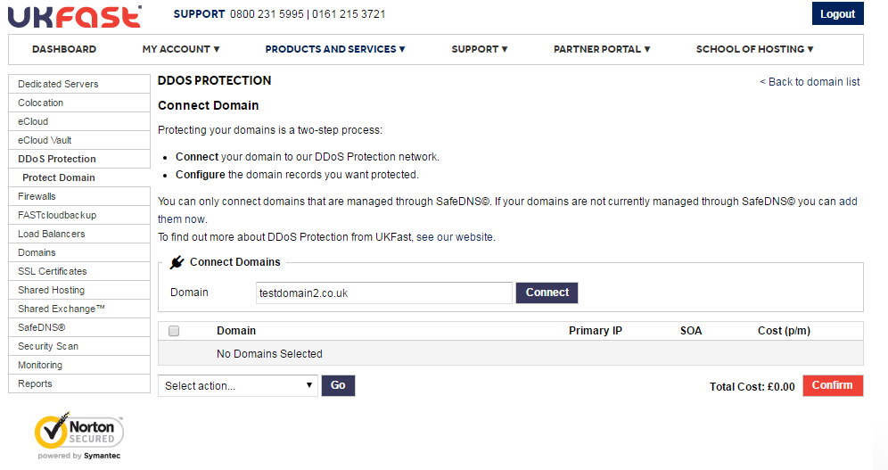
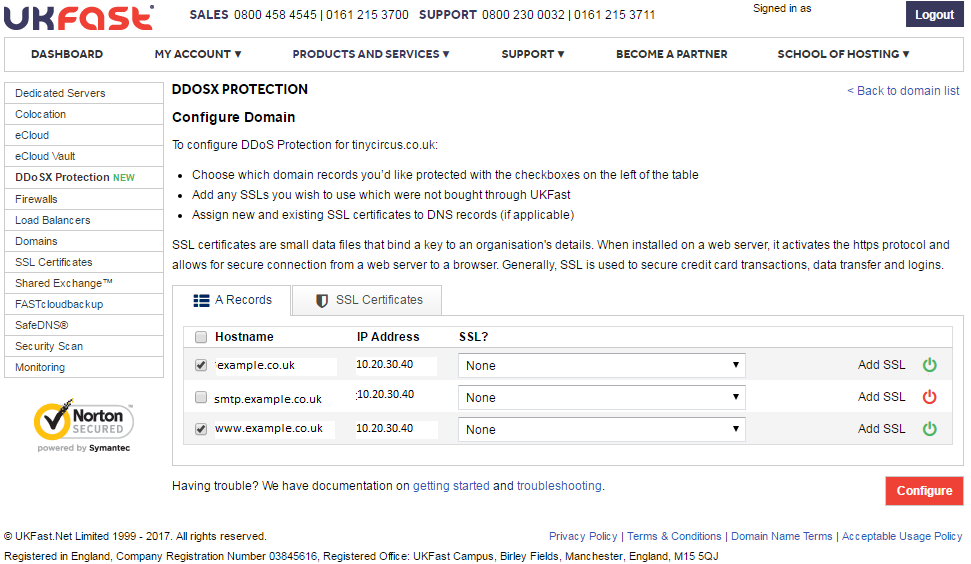
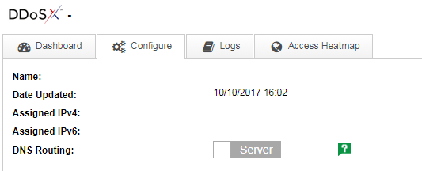

# Getting started with DDoSX, CDN and WAF

DDoSX<sup>®</sup>, Content Delivery Network (CDN) and Web Application Firewall (WAF) are features of our global network that work together to significantly improve your website or web application’s speed and security. DDoSX<sup>®</sup> provides protection against DDoS attacks. CDN is an **optional** feature that caches your site's content closer to the end user, and WAF is another **optional** feature which provides protection at the application layer for your domains. In order to use CDN and WAF, DDoSX must first be enabled on your domain(s).

```eval_rst
.. seealso::

   To use DDoSX\ :sup:`®`, CDN and WAF from UKFast, you need to have your domains' nameservers pointing to the UKFast nameservers, and you also need to manage your DNS records using SafeDNS.

   Make sure to set up your DNS records correctly in SafeDNS first - see the :doc:`/Domains/safedns/index` guide for assistance.  You must move all records associated with the domains (including sub-domains) you wish to protect, including SMTP, MX, mail etc. to SafeDNS.

   Once you have done this, point your domains to the UKFast nameservers, which are:

   - ns0.ukfast.net
   - ns1.ukfast.net

   You'll need to do this through whichever domain registrar you use to manage your domains (which may not be UKFast).  If you don't know who your domain registrar is you can do a 'WHOIS' lookup on websites such as https://whois.icann.org/

```

```eval_rst
.. warning::

   DDoSX supports HTTP and HTTPS web traffic on ports 80 and 443 respectively. If you need to route other types of traffic to your UKFast-hosted solution then please contact us before setting up DDoSX.

```

To enable DDoSX<sup>®</sup>, CDN and WAF on your domains, follow these steps:

**[1. Connect](#connect-domain)** your domain(s) to DDoSX

**[2. Configure](#configure-domain)** which domain records you'd like to protect

**[3. Test](#test-domain-and-put-live)** your domains will work properly on the DDoSX network before putting them live

**[4. Create CDN Caching Rules](#create-cdn-caching-rules)** for any CDN-enabled domains

**[5. Configure WAF settings](#configure-waf-settings)** for any domains requiring WAF protection

## Connect domain

- Login to [MyUKFast](https://my.ukfast.co.uk) and head to `DDoSX & CDN` in the `Products and Services` menu.
- Click `Connect Now`
- On this page you can search for the domains you're managing through SafeDNS. (if you havent added your domains to SafeDNS yet, please refer to the info box at the top of this page)
- Choose the domain you wish to protect and click `Connect`.
- To add [Content Delivery Network (CDN)](/network/cdn/) or Web Application Firewall to your order, set the relevant toggle switches to "On".
- Repeat for each domain you want to add to the network.



- Click `Confirm` to go through the payment process. (You won't have to complete this step if you've ordered DDoSX<sup>®</sup>, WAF or CDN via your UKFast account manager - you should see the relevant credits in your MyUKFast account already).

## Configure domain

- Click `Configure` next to the domain you wish to setup, and choose which A Records and AAAA Records you specifically want to protect for the domain.
- You can assign any existing SSL certificates at this point. SSL certificates purchased from MyUKFast will appear in the dropdown menu, or click `Add SSL` to add details of other SSL certificates manually. SSL certificates can be managed within the `SSL Certificates` tab.
- Ensure the DDoSX Protection toggle switches are set to "On" for all of the records and sub-domains you wish to protect.



- Click `Apply Changes` and your domain will now be connected to the UKFast DDoSX<sup>®</sup> network, and configured appropriately. (You should allow up to 10 minutes for the changes to be fully applied)

## Test domain and put live

- Once you've connected your domain to the DDoSX network and configured your DNS records, you may wish to test that your website or application will work correctly before changing your live DNS routing.  This can be done by modifying your local `hosts` file to look for the DDoSX "Assigned IPv4" address for your domain.

- You will see that initially your DNS Routing is shown as "Server", as per below.



- Locate the `hosts` file on your computer.  On Windows you'll find it in **C:\Windows\System32\drivers\etc**.  

- Open the `hosts` file using Notepad or another plain text editor (you may need administrator rights to make changes), and insert a line for each domain you wish to test, that includes the domain and the Assigned IPv4 address from DDoSX; for example:

 ```
 185.156.64.0 mydomain.co.uk
 185.156.64.0 www.mydomain.co.uk
 185.156.64.0 blog.mydomain.co.uk
 ```
- On Linux and MacOS you can open and edit the `hosts` file in a terminal window using a command such as

 ```
 sudo nano /private/etc/hosts
 ```

- [This article](https://www.howtogeek.com/howto/27350/beginner-geek-how-to-edit-your-hosts-file/) contains more detailed instructions on modifying the `hosts` file on MacOS, Linux, and different versions of Windows.

- Once you've added all the domains you need to test to your `hosts` file, save the changes. Then open a web browser and try browsing to your domain.  Your local `hosts` file will route the request directly to the DDoSX IP address so you'll be able to see exactly how your site will perform when you change your DNS records.

- If you're happy with how your site performs, you can switch the DNS Routing for your domain to "DDoSX".  Note that it may take [up to 48 hours](/Domains/domains/dnspropagation.html) for DNS changes to propogate across the internet (as with any such changes), and before your domain is fully protected.

## Create CDN caching rules

For any domains with CDN added, content caching will not be activated until you have [added caching rules to the configuration](/network/cdn/cachingrules.html)

## Configure WAF settings

Navigate to the WAF tab to find the settings for WAF on DDoSX.  There are a number of [different WAF settings](/security/ddos/wafsettings.html) that allow you to manage the level of protection for your domain.

```eval_rst
.. warning::

   Always run your WAF in Detection Only mode for a period of time before switching it on, otherwise you could cause issues that prevent your application from being accessible to you or your customers.  More details available on the :doc:`/security/ddos/wafsettings` page.

```

## Configure webserver logging (optional)

Once your domain is fully enabled on DDoSX, all requests to your webserver will appear to come from the DDoSX IP address rather than the original client. Therefore you may wish to configure your webserver to place the original client IP address into the logs. This is most important if you're using a stats package like Webalizer or AWStats, which rely on analysing your local webserver logs.

Here's how to do this for nginx and Apache:

### nginx

For nginx, insert this code into one of the `http` or `server` blocks in your configuration. This requires the [realip](https://nginx.org/en/docs/http/ngx_http_realip_module.html) module be compiled into nginx. You can confirm if this is already there with `nginx -V 2>&1 | grep -o realip`. If this outputs `realip`, you're good to go.

```
set_real_ip_from 185.156.64.0/24;
set_real_ip_from 23.170.128.0/24;
set_real_ip_from 2a02:21a8:1::/48;
set_real_ip_from 2a02:21a8:2::/48;
set_real_ip_from 2a02:21a8::/48;
real_ip_header X-Forwarded-For;
real_ip_recursive on;
```

Once you have added these into your configuration, test and reload your nginx configuration (e.g. `nginx -t && systemctl reload nginx`) to make the changes live.

### Apache

For Apache 2.4 and above, you will need to use the [mod_remoteip](https://httpd.apache.org/docs/current/mod/mod_remoteip.html) module. This should be compiled into your Apache installation, but you can confirm this by running `httpd -M 2>&1 | grep remoteip` (use `apache2ctl` instead of `httpd` on Debian/Ubuntu), which should output `remoteip_module (shared)`. As long as you have that, you're good to go. Add the following into your `<VirtualHost>` declaration, and then alter any `CustomLog` directives to use the newly defined `LogFormat`.

```
<IfModule remoteip_module>
    RemoteIPHeader X-Forwarded-For
    RemoteIPTrustedProxy 185.156.64.0/24
    RemoteIPTrustedProxy 23.170.128.0/24
    RemoteIPTrustedProxy 2a02:21a8:1::/48
    RemoteIPTrustedProxy 2a02:21a8:2::/48
    RemoteIPTrustedProxy 2a02:21a8::/48
</IfModule>
LogFormat "%a %l %u %t \"%r\" %>s %b \"%{Referer}i\" \"%{User-Agent}i\"" ddosx

# You may already have a line like the following in your VirtualHost declaration,
# if so, change the last part (likely the word 'combined') to 'ddosx' to use the
# above log format.
CustomLog /var/log/httpd/acmecorp.com/access.log ddosx
```

Test and then reload your Apache configuration (e.g. `httpd -t && systemctl reload httpd`) to make the changes live.

For Apache 2.2 you will need to use [mod_rpaf](https://github.com/gnif/mod_rpaf), the use of which is beyond the scope of this document.


```eval_rst
.. meta::
     :title: Getting started with DDoSX, WAF and CDN | UKFast Documentation
     :description: Guidance to setting up DDoSX, WAF and CDN from UKFast
     :keywords: ddos, ddos protection, anti-ddos, cdn, content delivery, content delivery network, waf, web application firewall
```
