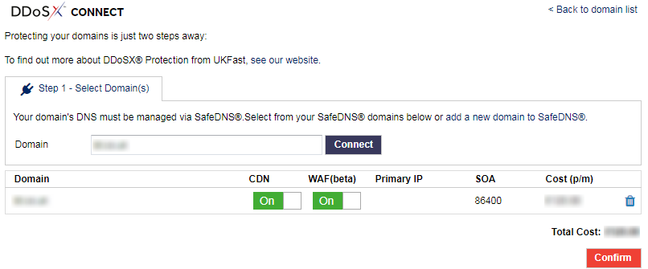

# Getting started

Protecting your domains using DDoS Protection is a two step process:

- **connect** your domain(s) to our DDoS Protection network
- **configure** which domain records you'd like to protect

```eval_rst
.. seealso::

To use DDoS Protection from UKFast, you also need to manage your DNS records using SafeDNS.  If you're not already doing so, please see [the SafeDNS guide](/source/Domains/safedns/index) to set this up first.

Use SafeDNS to point your domains to the UKFast nameservers, which are:

- ns0.ukfast.co.uk
- ns1.ukfast.co.uk

```

To enable DDoS Protection on your domain(s), follow these steps:

1. Login to [MyUKFast](https://my.ukfast.co.uk) and head to `DDoS Protection` in the `Products and Services` menu.
2. Click `Protect Domain`
3. On this page you can search for the domains you're managing through SafeDNS.  Choose the domain you wish to protect and click `Connect`.  Repeat for each domain you wish to protect.



4. If appropriate, go through the payment process. (You won't have to complete this step if you've already ordered DDoS Protection via your UKFast account manager).
5. Next click `Configure` and then choose which A Records and AAAA Records you specifically want to protect for each domian.  You can also assign any existing SSL certificates at this point.


6. Click `Activate` and your domain is now connected to the UKFast DDoS Protection network, and configured appropriately.  

Note that it may take up to 24 hours for DNS changes to propogate across the internet (as with any such changes), and before your domain is fully protected.
