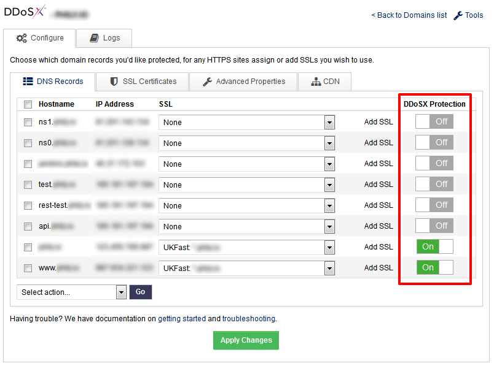

# Getting started

DDoSX<sup>®</sup> and Content Delivery Network (CDN) are two features of our global network that work together to significantly improve your website or web application’s speed and security. DDoSX<sup>®</sup> provides protection against DDoS attacks, and CDN is an **optional** feature that caches your site's content closer to the end user. In order to use CDN, DDoSX must also be enabled on the domain.

```eval_rst
.. seealso::

   To use DDoSX\ :sup:`®` and optional Content Delivery Network from UKFast, you need to have your domains' nameservers pointing to the UKFast nameservers, and you also need to manage your DNS records using SafeDNS.

   Make sure to set up your DNS records correctly in SafeDNS first - see the :doc:`/Domains/safedns/index` guide for assistance.  You must move all records associated with the domains (including sub-domains) you wish to protect, including SMTP, MX, mail etc. to SafeDNS.

   Once you have done this, point your domains to the UKFast nameservers, which are:

   - ns0.ukfast.net
   - ns1.ukfast.net

   You'll need to do this through whichever domain registrar you use to manage your domains (which may not be UKFast).  If you don't know who your domain registrar is you can do a 'WHOIS' lookup on websites such as https://whois.icann.org/

```

Enabling DDoSX<sup>®</sup> and CDN on your domains is a three-step process:

**[1. Connect](#connect-domain)** your domain(s) to our global network

**[2. Configure](#configure-domain)** which domain records you'd like to protect

**[3. Create CDN Caching Rules](#create-cdn-caching-rules)**

## Connect domain

- Login to [MyUKFast](https://my.ukfast.co.uk) and head to `DDoSX & CDN` in the `Products and Services` menu.
- Click `Connect Now`
- On this page you can search for the domains you're managing through SafeDNS. (if you havent added your domains to SafeDNS yet, please refer to the info box at the top of this page)
- Choose the domain you wish to protect and click `Connect`.
- Optionally, to add CDN to your order, ensure the highlighted toggle switch is set to "On".
- Repeat for each domain you want to add to the network.


- Click `Confirm` to go through the payment process. (You won't have to complete this step if you've already ordered DDoSX<sup>®</sup> or CDN via your UKFast account manager).


## Configure domain

- Now that the domain has been added to the network, the DNS records need to be configured.
- Click `Configure` next to the domain you wish to setup first within the `DDoSX & CDN` control panel and choose which A Records and AAAA Records you specifically want to protect for each domain.
- You can also assign any existing SSL certificates at this point. SSL certificates purchased from MyUKFast will appear in the dropdown menu, or click `Add SSL` to add details of other SSL certificates manually. SSL certificates can be managed within the `SSL Certificates` tab.
- Ensure the highlighted toggle switches are set to "On" for all of the sub-domains you wish to protect with DDoSX<sup>®</sup>.



- Click `Apply Changes` and your domain is now connected to the UKFast DDoSX<sup>®</sup> network, and configured appropriately.  

Note that it may take [up to 24 hours](/Domains/domains/dnspropagation.html) for DNS changes to propogate across the internet (as with any such changes), and before your domain is fully protected.

## Create CDN caching rules

For any domains with CDN added, content caching will not be activated until rules have been added to the configuration.

[Follow this link to the CDN 'caching rules' setup guide](/network/cdn/cachingrules.html)

## Configure webserver logging

Because all the requests to your webserver will now appear to come from DDoSX<sup>®</sup> rather than the original clients, you should configure your webserver to place the original client IPs into the logs. This is most important if you're using a stats package like Webalizer or AWStats, which rely on analysing your local webserver logs. 

For nginx, inserting this code into one of the `http` or `server` blocks in your configuration should do the trick. This requires the [realip](https://nginx.org/en/docs/http/ngx_http_realip_module.html) module be compiled into nginx. You can confirm if this is already there with `nginx -V 2>&1 | grep --color=auto -o realip`. If this outputs `realip`, you're good to go.

```
set_real_ip_from 185.156.64.0/24;
set_real_ip_from 23.170.128.0/24;
set_real_ip_from 2a02:21a8:1::/48;
set_real_ip_from 2a02:21a8:2::/48;
set_real_ip_from 2a02:21a8::/48;
real_ip_header X-Forwarded-For;
real_ip_recursive on;
```

