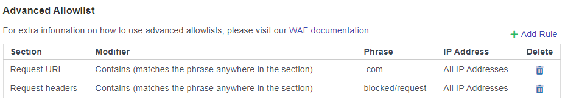

# Global Restrictions

Documentation of global restrictions that are applied to any customers using DDoSX® and SafeDNS™

## DDoSX®
### User-Agents:
* PetalBot
### IPs:
* 135.148.33.67
## SafeDNS™
#### IPs:
* 39.105.171.83
* 39.96.129.118
* 205.198.12.8
* 116.62.21.155
* 135.148.33.67

## WAF on DDoSX®
* Forbidden File Extensions
   * `.asa/ .asax/ .ascx/ .backup/ .bak/ .bat/ .cdx/ .cer/ .cfg/ .cmd/ .com/ .config/ .conf/ .cs/ .csproj/ .csr/ .dat/ .db/ .dbf/ .dll/ .dos/ .htr/ .htw/ .ida/ .idc/ .idq/ .inc/ .ini/ .key/ .licx/ .lnk/ .log/ .mdb/ .old/ .pass/ .pdb/ .pol/ .printer/ .pwd/ .rdb/ .resources/ .resx/ .sql/ .swp/ .sys/ .vb/ .vbs/ .vbproj/ .vsdisco/ .webinfo/ .xsd/ .xsx/`

* Allowed Methods (All Others Denied)
  * `GET HEAD POST OPTIONS PURGE DELETE PUT PATCH`

* Allowed Request Content-Types (All Others Denied)
  * `application/x-www-form-urlencoded multipart/form-data text/xml application/xml application/soap+xml application/x-amf application/json application/octet-stream text/plain application/vnd.api+json application/soap+xml text/html text/json`

If you are having issues with the file extensions or the Request Content-Type you can whitelist these in Advanced Allowlist using:



```eval_rst
   .. title:: Global Restrictions on SafeDNS™ and DDoSX® | ANS Documentation
   .. meta::
      :description: Global Restrictions applied on SafeDNS™ and DDoSX® security
      :keywords: restrictions, ddosx, safedns, blocked, denied, 403, forbidden
```