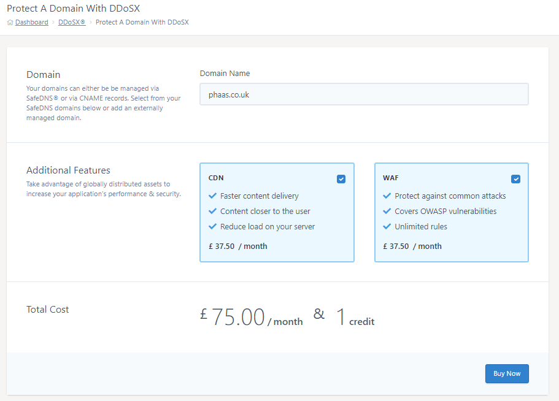
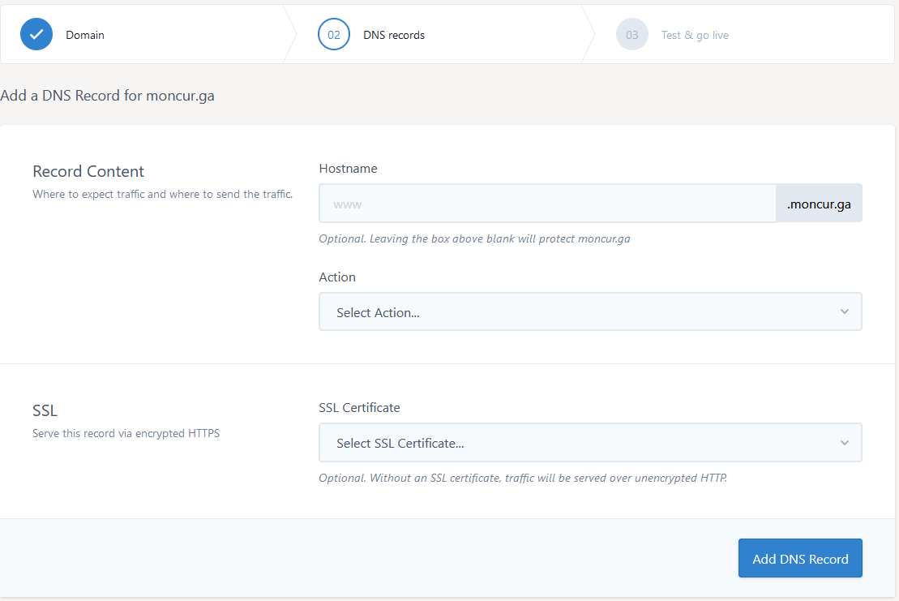
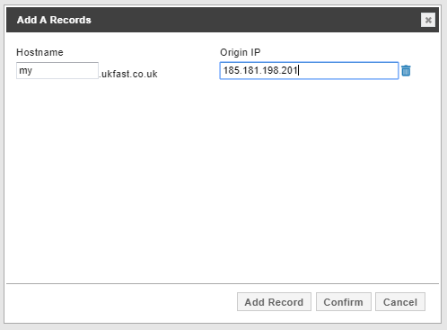
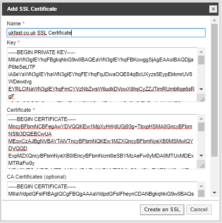

# Setting up DDoSX<sup>®</sup>, CDN and WAF using SafeDNS

DDoSX<sup>®</sup>, can be setup to protect any domain from DDoS and common Web Application attacks such as SQL Injections, Remote Command Execution and Cross-Site Scripting (XSS). More on how DDoSX<sup>®</sup> works can be found in our [DDoSX General Information](/security/ddos/generalinformation)

CDN and WAF are optional additional DDoSX<sup>®</sup> features, and as a result, DDoSX must first be enabled on your domain(s) to allow CDN and WAF to be configured.

To use DDoSX<sup>®</sup>, CDN and WAF, you need to either have your domains' setup on UKFast SafeDNS and ensure its name servers pointing to the UKFast name servers or create an ANAME/ALIAS record with your current DNS provider to point to DDoSX<sup>®</sup> using a provided CNAME.

```eval_rst
.. warning::
   This documentation is for setting up DDoSX using SafeDNS. Documentation on setting up an external domain via an ALIAS, ANAME or CNAME can be found in our :doc:`/security/ddos/setup-cname` documentation.
```

To enable DDoSX<sup>®</sup>, CDN and WAF on your domains, follow these steps:

**[1. Prepare](#prepare-your-domain)** your domain(s) before adding to DDoSX<sup>®</sup>

**[2. Connect](#connect-your-domain)** your domain(s) to DDoSX<sup>®</sup>

**[3. Configure Domain](#configure-domain)** your domain(s) with your preferred proxy settings

**[4. Configure Additional Features](#configure-additional-features)** for any CDN or WAF enabled domains

**[5. Test Domain and Put Live](#test-domain-and-put-live)** your domain(s) work properly before putting them live

```eval_rst
.. warning::

   DDoSX supports HTTP and HTTPS web traffic on ports 80 and 443 respectively. If you need to route other types of traffic to your UKFast-hosted solution then please contact us before setting up DDoSX

```

## 1) Prepare your domain

The first step to setting up DDoSX<sup>®</sup> via SafeDNS is to prepare and check your domain before enabling DDoSX<sup>®</sup> protection.

Before setting up a SafeDNS domain in DDoSX<sup>®</sup>, double-check that your domain is set up correctly and working as expected through SafeDNS. Documentation on how to setup SafeDNS can be found in our [SafeDNS Documentation](/domains/safedns/index) should you assistance.

You must move all records associated with the domains (including sub-domains) you wish to protect, including SMTP, MX, mail, etc. to SafeDNS.

Once you have done this, point your domains to the UKFast name servers, which are:

- `ns0.ukfast.net`
- `ns1.ukfast.net`

You'll need to do this through whichever domain registrar you use to manage your domains (which may not be UKFast). If you don't know who your domain registrar is you can do a 'WHOIS' lookup on websites such as https://whois.icann.org/

The name server change may take up to 48 hours to propagate across the world. A good tool to check this is https://www.whatsmydns.net/

## 2) Connect your domain

- Login to [MyUKFast](https://my.ukfast.co.uk) and head to `DDoSX Protection` in the navigation menu.

- Click on `Protect A Domain` button to start adding your domain.

- Enter the domain that you want to protect in the 'Domain Name' text box

- Select any additional features you'd like to add to this domain such as CDN or WAF by clicking the checkbox next to your chosen features.

- Double-check your domain and selected additional features and then press 'Buy Now'

- Click `Complete Transaction` on the next page to complete the payment process. (You won't have to complete this step if you have already ordered DDoSX<sup>®</sup>, WAF or CDN via your UKFast account manager -  Any existing credits will be consumed first).



## 3) Configure Domain

Once a new domain has been added to DDoSX<sup>®</sup>, you will automatically be taken to the configuration page for that domain.

**Setting up Records**

Click on `Protect an A record` and fill in the details where `Hostname` is the subdomain you wish to protect or you can leave this blank to protect the [apex record](https://docs.ukfast.co.uk/domains/safedns/apexdomain.html).

Select an `Action` between `Create new DNS record` or `Stage new DNS record`. The first option will add the record on DDoSX and switch the DNS to DDoSX<sup>®</sup>, and the second option will add the record, however the DNS will continue to point to the IP entered in `New IP Address`.
For both actions the IP entered in `New IP Address` is the IP where your website is hosted or perhaps a load balancer VIP.

SSL certificate you can either choose `Select SSL Certificate...` to select an SSL you have in https://my.ukfast.co.uk. `Add SSL Certificate` gives you the option to grab an external SSL and upload it to DDoSX<sup>®</sup>. Finally if you don't select an SSL certificate you can bring the site live without one just by clicking on `Add DNS Record`



Alternatively, navigate to the main DDoSX<sup>®</sup> page on via the navigation bar on the left, click on the domain you want to configure, and then and click `Configure` tab.

First, use the `Add Record` button to configure your root and subdomains' origin IP address. This will be the IP address that the request is forwarded to after being routed through DDoSX<sup>®</sup>. This is usually your web server or load balancer's external IP address.



You can add multiple subdomains at once via the `Add Record` button. Once you're happy with your configure, press the `Confirm` button

The origin IP address of any of your subdomains (Including your root domain) can be changed by editing the IP in the text box shown under `Origin IP` for the specific record.

**Adding SSL Certificates**

Before pressing the `Apply Changes` button, we can add any required SSL certificates to our domains.

To add an SSL certificate, click the `SSL` Tab. Any existing SSL certificates or SSL certificates purchased through UKFast for this domain should show up here.

If the required SSL certificate for the domain does not show up in here, we can add it by pressing the `Add SSL` button.

Enter your SSL's Private Key, Certificate, any CA/Chain certificates (Optional) and a name for this SSL. Press the `Create an SSL` button to add your SSL to DDoSX<sup>®</sup>.



At this point, you should be able to go back into the `DNS Records` tab and select the SSL you want to apply via the `SSL` dropdown for each record. Only SSLs that are valid for the configured subdomain will show in the dropdown. For example, an SSL for only `www.ukfast.co.uk` and `ukfast.co.uk` will NOT show in the dropdown for `my.ukfast.co.uk`. Wildcard SSL certificates should show for all applicable subdomains.

Ensure that the `DDoSX Protection` toggle switch is enabled for all the domains you want to enable DDoSX<sup>®</sup> for. This will **NOT** put DDoSX<sup>®</sup> live just yet, toggling this switch will only enable the domain within DDoSX<sup>®</sup>.


Finally, click `Apply Changes` and your domain will now be set up on the UKFast DDoSX<sup>®</sup> network, and configured appropriately. (You should allow up to 10 minutes for the changes to be fully applied)

## 4) Configure Additional Features

You now have the option to configure and additional DDoSX<sup>®</sup> features such as CDN and WAF before testing and putting your domain live.

The configuration of CDN and WAF can be quite complex, so each has its own documentation.

[CDN Documentation](/network/cdn/cachingrules)

[WAF Documentation](/security/ddos/wafsettings)

Alternatively, you can skip the configuration of additional features for now and re-visit it after DDoSX<sup>®</sup> has been verified as working and put live. To do this, continue to step 5.

## 5) Test domain and put live

Once you've connected your domain to the DDoSX<sup>®</sup> network and configured your DNS records, you may wish to test that your website or application will work correctly before changing your live DNS routing.  This can be done by modifying your local `hosts` file to look for the DDoSX<sup>®</sup> "Assigned IPv4" address for your domain.

You will see that initially your DNS Routing is shown as "Server", as per below.


Locate the `hosts` file on your computer.  On Windows, you'll find it in **C:\Windows\System32\drivers\etc**.

Open the `hosts` file using Notepad or another plain text editor (you may need administrator rights to make changes), and insert a line for each domain you wish to test, that includes the domain and the Assigned <nospell>IPv4</nospell> address from DDoSX<sup>®</sup>; for example:

```console
185.156.64.0 mydomain.co.uk
185.156.64.0 www.mydomain.co.uk
185.156.64.0 blog.mydomain.co.uk
```

On Linux and macOS you can open and edit the `hosts` file in a terminal window using a command such as

```console
sudo nano /private/etc/hosts
```

[This article](https://www.howtogeek.com/howto/27350/beginner-geek-how-to-edit-your-hosts-file/) contains more detailed instructions on modifying the `hosts` file on macOS, Linux, and different versions of Windows.

Once you've added all the domains you need to test to your `hosts` file, save the changes. Then open a web browser and try browsing to your domain.  Your local `hosts` file will route the request directly to the DDoSX<sup>®</sup> IP address so you'll be able to see exactly how your site will perform when you change your DNS records.

If you're happy with how your site performs, you can switch the DNS Routing for your domain to "DDoSX<sup>®</sup>".  Note that it may take [up to 48 hours](/domains/domains/dnspropagation) for DNS changes to propagate across the internet (as with any such changes), and before your domain is fully protected.

Once DNS propagation had concluded, your domain will be fully set up with DDoSX<sup>®</sup> protection.

## Further Configuration

You may wish to add further configuration on your origin server to work more closely with DDoSX<sup>®</sup>. Some common configurations are documented below.

### Block Traffic not from DDoSX<sup>®</sup> (optional but recommended)

```eval_rst
.. warning::

   Make sure all websites hosted on your origin server are behind DDoSX before applying these firewall rules. As doing so cut off access to any websites not protected by DDoSX.

```

Now that DDoSX<sup>®</sup> is configured for your domain, and requests going to your domain and via common name servers will be routed through DDoSX<sup>®</sup>, however, attackers commonly try to avoid proxies like DDoSX<sup>®</sup> by using custom DNS servers to make the domain resolve to your origin server's IP instead of DDoSX<sup>®</sup>, bypassing the protection it offers. Furthermore, an attacker may still be able to attack your origin server by sending requests to the IP directly, (http://185.234.39.17/ for example).

To prevent both these evasion methods, you can add firewall rules to only allow traffic on port TCP 443 and TCP 80 from our DDoSX<sup>®</sup> IP ranges mentioned below.

```console
185.156.64.0/24
192.166.44.0/24
78.24.88.0/24
185.181.196.0/22
```

These rules would commonly take the form of an allow rule for port TCP 80 and TCP 443 for each of the above IP ranges, followed by a deny rule for all other IPs using TCP 80 and TCP 443.

Example rules for IPTables are below:

```console
iptables --append INPUT --protocol tcp --src 185.156.64.0/24 --dport 80 --jump ACCEPT
iptables --append INPUT --protocol tcp --src 192.166.44.0/24 --dport 80 --jump ACCEPT
iptables --append INPUT --protocol tcp --src 78.24.88.0/24 --dport 80 --jump ACCEPT
iptables --append INPUT --protocol tcp --src 185.181.196.0/22 --dport 80 --jump ACCEPT
iptables --append INPUT --protocol tcp --src 185.156.64.0/24 --dport 443 --jump ACCEPT
iptables --append INPUT --protocol tcp --src 192.166.44.0/24 --dport 443 --jump ACCEPT
iptables --append INPUT --protocol tcp --src 78.24.88.0/24 --dport 443 --jump ACCEPT
iptables --append INPUT --protocol tcp --src 185.181.196.0/22 --dport 443 --jump ACCEPT
iptables --append INPUT --protocol tcp --dport 80 --jump DROP
iptables --append INPUT --protocol tcp --dport 443 --jump DROP
```

### Configure webserver logging (optional but recommended)

Once your domain is fully enabled on DDoSX<sup>®</sup>, all requests to your webserver will appear to come from the DDoSX<sup>®</sup> IP address rather than the original client. Therefore you may wish to configure your webserver to place the original client IP address into the logs. This is most important if you're using a stats package like Webalizer or AWStats, which rely on analysing your local web server logs.

Here's how to do this for NGINX and Apache:

**NGINX**

For NGINX, insert this code into one of the `http` or `server` blocks in your configuration. This requires the [`realip`](https://nginx.org/en/docs/http/ngx_http_realip_module.html) module be compiled into NGINX. You can confirm if this is already there with `nginx -V 2>&1 | grep -o realip`. If this outputs `realip`, you're good to go.

```nginx
set_real_ip_from 185.156.64.0/24;
set_real_ip_from 192.166.44.0/24;
set_real_ip_from 78.24.88.0/24;
set_real_ip_from 2a02:21a8:1::/48;
set_real_ip_from 2a09:ba00:4::/48;
set_real_ip_from 2a09:b600:5::/48;
real_ip_header X-Forwarded-For;
real_ip_recursive on;
```

Once you have added these into your configuration, test and reload your NGINX configuration (e.g. `nginx -t && systemctl reload nginx`) to make the changes live.

**Apache**

For Apache 2.4 and above, you will need to use the [`mod_remoteip`](https://httpd.apache.org/docs/current/mod/mod_remoteip.html) module. This should be compiled into your Apache installation, but you can confirm this by running `httpd -M 2>&1 | grep remoteip` (use `apache2ctl` instead of `httpd` on Debian/Ubuntu), which should output `remoteip_module (shared)`. As long as you have that, you're good to go. Add the following into your `<VirtualHost>` declaration, and then alter any `CustomLog` directives to use the newly defined `LogFormat`.

```apacheconf
<IfModule remoteip_module>
    RemoteIPHeader X-Forwarded-For
    RemoteIPTrustedProxy 185.156.64.0/24
    RemoteIPTrustedProxy 192.166.44.0/24
    RemoteIPTrustedProxy 78.24.88.0/24
    RemoteIPTrustedProxy 2a02:21a8:1::/48
    RemoteIPTrustedProxy 2a09:ba00:4::/48
    RemoteIPTrustedProxy 2a09:b600:5::/48
</IfModule>
LogFormat "%a %l %u %t \"%r\" %>s %b \"%{Referer}i\" \"%{User-Agent}i\"" ddosx

# You may already have a line like the following in your VirtualHost declaration,
# if so, change the last part (likely the word `combined`) to `ddosx` to use the
# above log format.
CustomLog /var/log/httpd/acmecorp.com/access.log ddosx
```

Test and then reload your Apache configuration (e.g. `httpd -t && systemctl reload httpd`) to make the changes live.

For Apache 2.2 you will need to use [`mod_rpaf`](https://github.com/gnif/mod_rpaf), the use of which is beyond the scope of this document.

**HAProxy**

If you have HAProxy in front of your webservers, you'll probably want to set the
`X-Forwarded-For` header on here. The easiest way to do this is to disable the
`forwardfor` option to prevent HAProxy setting the header automatically and instead
set the header manually in each backend.

First, comment out your `forwardfor` option, potentially in the `defaults` section, e.g.

```console
defaults
    #option forwardfor except 192.168.1.10
...
```

Then, in each backend set the `X-Forwarded-For` header to match the value of the `DDOSX-Connecting-IP` header:

```console
backend webservers
    mode http
    http-request set-header X-Forwarded-For %[req.hdr(DDOSX-Connecting-IP)]
    server web1 ...
```

```eval_rst
   .. title:: Getting started with DDoSX, WAF and CDN with SafeDNS
   .. meta::
      :title: Getting started with DDoSX, WAF and CDN with SafeDNS | UKFast Documentation
      :description: Guidance to setting up DDoSX, WAF and CDN from UKFast
      :keywords: ddos, ddos protection, anti-ddos, cdn, content delivery, content delivery network, waf, web application firewall
```
