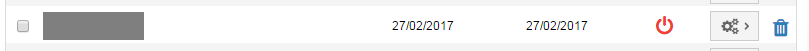
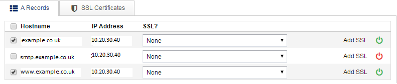

# Troubleshooting

This section should help with any problems you run in to.

## I can't connect my domain(s) to the DDoSX<sup>®</sup> network

If you're struggling to connect your domains, first check that you are using [SafeDNS](/Domains/safedns/index.html) to manage your DNS records.  You neeed to use SafeDNS and point your domains to the UKFast nameservers, which are
- ns0.ukfast.co.uk
- ns1.ukfast.co.uk

You'll find SafeDNS in [MyUKFast](https://my.ukfast.co.uk) - just log in and go to `SafeDNS` under the `Products and Services` menu.  You should also read the full [SafeDNS guide](/Domains/safedns/index.html)

## My domain is showing as Not Configured, why is this?

If your domain is connected to the DDoSX<sup>®</sup> network but not yet configured, you'll see a red icon in the Status column on the Manage Domains page - see example below



To configure your domain, simply click on the Settings button next to the domain in question, and then `Configure`.  Run through the process as set out in the [Getting Started guide](/security/ddos/gettingstarted.html)

## My website does not work as expected over HTTPS

Ensure that the correct SSL certificate is selected in the dropdown box in the DDoSX<sup>®</sup> configuration section (click `Products & Services` > `DDoSX` > `Configure` to find this).  If this is set to none, there will be no HTTPS configuration for your domain. If using a custom SSL, ensure that the full SSL is correctly entered in the "SSL Certificates" tab.



## Traffic is not getting through to my server on ports other than 80 and 443

DDoSX is designed to support HTTP and HTTPS web traffic on ports 80 and 443 respectively. If you need to accept traffic on ports other than 80 and 443, you may find this doesn't work on DDoSX.  Please contact us to discuss further if this is the case.

## I've removed my domain from the DDoSX<sup>®</sup> network, and now my website is offline.

If you've previously had a domain connected to the DDoSX<sup>®</sup> network and then removed it, make sure to use [SafeDNS](/Domains/safedns/index.html) to point your DNS records directly back to your own server or firewall.  See the section on [Removing a domain from DDoSX<sup>®</sup>](/security/ddos/remove.html) for more details.

## My WAF on DDoSX doesn't appear to be blocking any traffic?

Make sure you've configured your [WAF settings](/security/ddos/wafsettings.html) correctly, and check your WAF is not either switched off, or in Detection Only mode.

## Why is my WAF blocking legitimate requests?

It can take time to configure your [WAF settings](/security/ddos/wafsettings.html) correctly in order to avoid "false positives", or blocking legitmate requests to your application.  Often this can require a trial-and-error approach to determine the optimal paranoia level and rulesets, that meet your security requirements without preventing legitimate users from accessing your application as needed.  We strongly recommend running your WAF in Detection Only mode for a period of time before switching it on.  This will give you the chance to understand which requests will be blocked, by analysing the log files produced.  Please contact UKFast support by raising a support ticket in [MyUKFast](https://my.ukfast.co.uk) if you need help with this.


```eval_rst
.. meta::
     :title: Troubleshooting DDoSX, WAF and CDN | UKFast Documentation
     :description: Help with common problems when using DDoSX, WAF and CDN from UKFast
     :keywords: ddos, ddos protection, anti-ddos, cdn, content delivery, content delivery network, troubleshooting, faqs, ports, offline, waf, web application firewall
```
