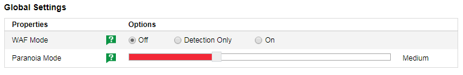
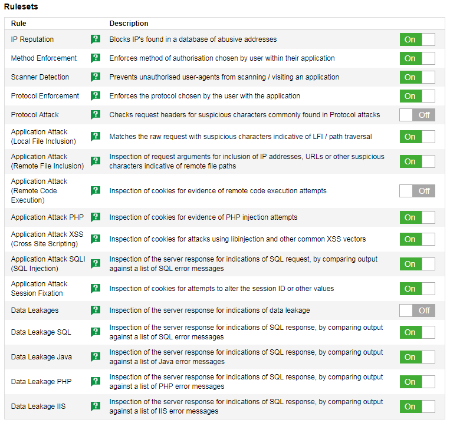
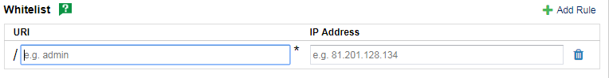

# WAF on DDoSX settings

Within the WAF tab in the DDoSX section of [MyUKFast](https://my.ukfast.co.uk) you will need to configure the various settings required to activate your WAF and control the level of security provided, as shown in the screenshot below.



## WAF Mode

The different WAF modes available are:

- **Off** – WAF not in use
- **Detection Only** – WAF is in test mode - it will report on what traffic will be blocked based on the current rulesets and paranoia mode selected, but is not actively blocking traffic.  This should be used to test your WAF settings on your domain before going live, which can help you to avoid false positives and customer experience issues
- **On** – The WAF is on and is now blocking requests as per the rulesets and paranoia level selected

```eval_rst
.. warning::

   Always run your WAF in Detection Only mode for a period of time before switching it on, otherwise you could cause issues that prevent your application from being accessible to you or your customers.

```

## Paranoia Mode

The Paranoia Mode (also known as 'Paranoia Level' or 'PL') setting determines the recommended rulesets to be implemented for the protection of your application.  You can further manage the granular level of protection provided by toggling rulesets on or off, see [Rule Sets](#rule-sets) section below on this.

With each paranoia mode increase, the Core Rule Set (CRS) enables additional rules to give a higher level of security. However, higher paranoia modes increase the possibility of blocking some legitimate traffic due to false alarms (also known as 'false positives' or 'FPs').

- **Paranoia Mode - Low (default) / PL1** has most core rules enabled. PL1 is advised for beginners, installations covering many different sites and applications, and for setups with standard security requirements. With PL1 you should rarely face FPs, however if you do please contact UKFast support by raising a ticket in [MyUKFast](https://my.ukfast.co.uk).

- **Paranoia Mode - Medium / PL2** includes many extra rules, for instance enabling many regexp-based SQL and XSS injection protections, and adding extra keywords checked for code injections. PL2 is advised for moderate to experienced users needing more complete coverage, and for installations with elevated security requirements. PL2 comes with some FPs which you will need to handle.

- **Paranoia Mode - High / PL3** enables more rules and keyword lists, and tweaks limits on special characters used. PL3 is aimed at users experienced with handling FPs, and at installations with a high security requirement.

- **Paranoia Mode - Highest / PL4** further restricts special characters. The highest level is advised for experienced users protecting applications with very high security requirements. Running PL4 will likely produce a very high number of FPs, which have to be treated before the application can go into production.

## Rule Sets

Once you have set your paranoia mode you can now decide which rules you would like to have turned on or off. The table below outlines each of the rulesets and what these mean.

- **IP REPUTATION:** A check is performed to see if the IP has already been blacklisted from previous requests, then a GeoIP lookup is performed, to determine if the IP resolves to a database of high risk countries. Following this it is checked again on IP Reputation.  The scoring becomes gradually more severe the higher the paranoia level.

- **METHOD ENFORCEMENT:** Enforces a hard list of methods, the allowed method types are as follows: GET, HEAD, POST, OPTIONS.

- **SCANNER DETECTION:** An analysis is performed of the headers of the incoming request against a list of known malicious user-agents and a threat score is assigned against the request based on what is found.

- **PROTOCOL ENFORCEMENT:** Validation of the users request line against the format specified found in the HTTP RFC, where the format is '"http:" "//" host [ ":" port ] [ abs_path [ "?" query ]]'. As well as for CONNECT, OPTIONS and GET requests.  Please see these articles on [w3.org](http://www.w3.org/Protocols/rfc2616/rfc2616-sec3.html#sec3.2.1) and [Capec](http://capec.mitre.org/data/definitions/272.html) for references.

- **PROTOCOL ATTACK:** Looks to detect the "," character within the Content-Length / Transfer-Encoding header values.  As well as the CR/LF character combinations in the HTTP method name. Please see [this article](http://projects.webappsec.org/HTTP-Request-Smuggling) for references.

- **APPLICATION ATTACK LFI (Local File Inclusion):** A number of rules which analyse the payload for path traversal and other indicators of local file inclusion, decoders to detect binary within the payload as well as attempts to reach restricted files.

- **APPLICATION ATTACK RFI (Remote File Inclusion):** Inspecting the arguments for possible attack methods for remote file inclusion, this includes looking for PHP such as "include()", URLs containing an IP address, data ends with question marks (?) and RFI host that does not match its local host value.

- **APPLICATION ATTACK RCE (Remote Code Execution):** This ruleset detects either Unix-based, or Windows-based shell command injections such as foo.jpg;uname -a for example, this ruleset is also case-sensitive to prevent false positives. Efforts have been made to detect common evasion techniques such as 'l'"s".  

- **APPLICATION ATTACK PHP:** Looks to identify the injection, or upload of PHP code by inspecting cookies and arguments for "<?" "<?php" opening tags, and file paths or names ending in .php. In addition it looks for the inspection of or detection of PHP configuration files in common locations, and the detection of use of PHP variables/functions from a database of common / known items.

- **APPLICATION ATTACK XSS (Cross Site Scripting):** This ruleset contains rules which search for indications of cross-site scripting, using libinjection libraries as well as a database of common attack filters.  This includes regular expression analysis for particular phrases or character combinations which are indicators of XSS.

- **APPLICATION ATTACK SQLI (SQL Injection):**
Rules which attempt to detect the use of SQL keywords to inject commands into the application / database, using RegEx to detect the use of database names, and the libinjection module to detect SQL keyword usage, such as SELECT, DROP, INSERT etc. whilst being mindful of false positives.  See [this article](http://websec.ca/kb/sql_injection) for references.

- **APPLICATION ATTACK SESSION FIXATION:** Attempts to detect the introduction of session fixation, which is the attempt to create a false session for another user to enter.  This is done by inspecting the cookies and arguments for the setting of cookie values in HTML or SessionID parameters with off-domain referrers.  See [this article](http://projects.webappsec.org/w/page/13246960/Session%20Fixation) for a full breakdown of session fixation.

- **DATA LEAKAGES:** Analysis of the response from the server to look for potential data leakage, such as directory listings and server status codes.

- **DATA LEAKAGE SQL:**
Analyses the response body from the server looking for potential leakage of SQL information, such as error warnings compiled from a list of common errors found sending a false or prohibited SQL query to a database.  

- **DATA LEAKAGE JAVA:** Analyses the response body from the server looking at potential leakage of Java error warnings / messages when an invalid or prohibited Java query has been sent to the server.  This is to prevent giving the attacker information about applications that you are running on the backend that is not wanted.

- **DATA LEAKAGE PHP:**
Analyses the response body from the server looking at potential leakage of PHP error warnings / messages when an invalid or prohibited PHP query has been sent to the server.  This is to prevent giving the attacker information about application that you're running on the backend that is not wanted.

- **DATA LEAKAGE IIS:** Analyses the response body from the server looking at potential leakage of IIS error warnings / messages when an invalid or prohibited SQL query has been sent to the server.  This is to prevent giving the attacker information about application that you're running on the backend that is not wanted.

You can choose which rulesets to switch on or off for each of your domains, using the toggle switches as shown in the screenshot below.  Remember the paranoia level you have selected will also influence how aggressively each ruleset switched on will block traffic.



## Whitelist Rules

Before switching your WAF mode to On and starting to block traffic to your application, you may wish to create whitelist rules to allow particular traffic through which you know be legitimate.  

An example of this would be allowing traffic from your own office network to bypass the rules enforced by the WAF.  A whitelist rule to accommodate this situation would look like this:

`SecRule REQUEST_URI "@beginsWith /admin" "chain, id:1, phase:1, t:none, nolog, pass, ctl:ruleEngine=DetectionOnly" SecRule REMOTE_ADDR "@ipMatch 8.8.8.8" "t:none"`

In simple terms this rule states - *any request made to the URI `/admin` by user with IP address `8.8.8.8` can be ignored and only log when a rule would be triggered.*

This rule in it's raw format may be off-putting, but you can add whitelist rules simply in the `Whitelist` section, by clicking `Add Rule` - see screenshot below.



To create your whitelist rule simply add:
- URI (e.g. `admin`)
- IP address (e.g. `8.8.8.8`)

You can build a rule like this yourself, by looking at the WAF Logs within [MyUKFast](https://my.ukfast.co.uk) for your domain, in order to determine:

- Where are violations coming from?  
- What parts of your website are being attacked?
- Are WAF rules being triggered by users you know to be legitimate?

For instance, using the "office network" example above - you know that traffic from your workplace originates from IP address 8.8.8.8 and that you need to use the /admin area of your site, but you are running into a large number of errors to this URI from your office location.  You can gather from this information that these will be false positives, and will impact your productivity if not addressed.

It is important to think carefully when applying whitelists, as the more you implement the less secure your site will become. You should always endeavour to balance security and accessibility - a task that requires a detailed knowledge of your website, application and end users (both internal to your company, as well as external).


```eval_rst
.. meta::
     :title: Web Application Firewall settings on DDoSX | UKFast Documentation
     :description: Help with setting up the Web Application Firewall feature on DDoSX
     :keywords: ddos, ddos protection, anti-ddos, ukfast, ddosx, web application firewall, waf
```
