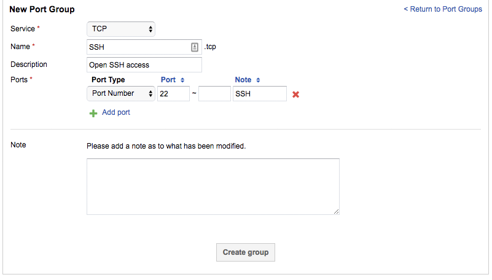

# How do I open a port on my firewall?

You can open up ports on your shared or dedicated firewall within the [MyUKFast portal](https://www.ukfast.co.uk/myukfast.html). Details on accessing the relevant area can be found [here](viewconfig.html).

If you don't have a group already setup that is relevant then you should add a new `Port Group`. So navigate to the `Port Groups` tab and then create a `New Port Group`.

Select the service you would like to open this port for, either TCP or UDP. Provide a name and description which will provide you an indication of the groups functionality at a later stage.

You can add single Ports or Port ranges that you would like to open up.

Once you are happy with the list, click on `Create Group`.

If you have an existing port group that is in use already then you can add the required ports to the group and nothing further is needed.

If you have just created a new port group or it's one that previously hasn't been used then you need to add the actual access list to have the group take effect.

Click `Add Incoming or Outgoing Interface Rule`, select the action as `Permit`, select the relevant source and destination options. Under `Ports`, select the new Port Group you created.

Click `Create` and the configuration will be updated.
