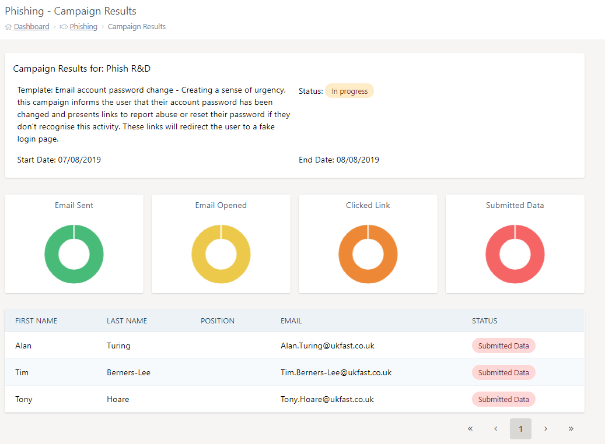

# Campaign Overview

Once a campaign has been started, you can easily view its overall status and track the actions of each user in the campaign. Looking at the example below, we can see that our test campaign has 3 users. Here we can see a per-user status and an overall status.

Once the user opens the email and downloads a tracking image, the user's status will be updated on the dashboard.

***Please note that mail clients like 'Microsoft Outlook' have a security feature, that prevents external resources such as images from being downloaded automatically. As a result, if a user opens an email via these mail clients, it may not show up as opened on MyUKfast.***

Also, we can see if a user has clicked the phishing link and submitted data. We can also see an overview of all the user's status as a doughnut visualization.

