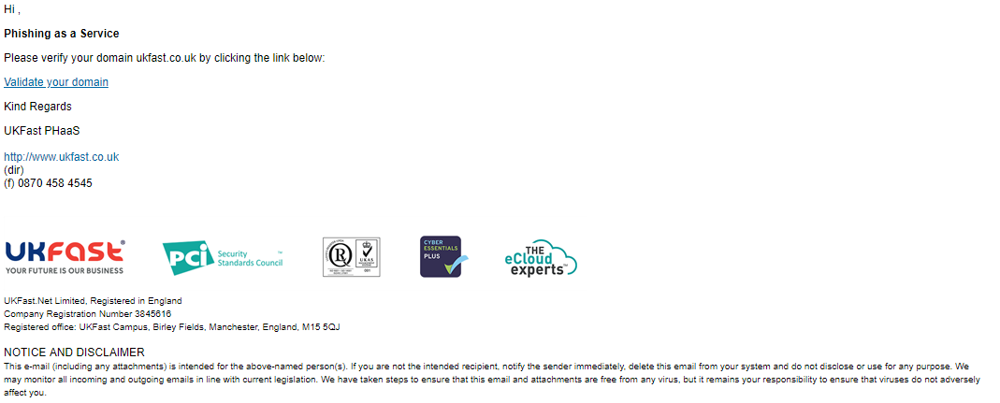

# How to launch a phishing campaign

UKFast Phishing campaigns can be easily launched through MyUKFast's 'Phishing' section. In here you'll be able to create a new campaign, add users, distribution groups see phishing templates and manage ongoing/previous phishing campaigns.

# 1) Verifying a domain

When you first access the phishing as a service section of MyUKFast, you'll see a progress banner towards the top of your page. you'll use this to track your progress when launching your first campaign.

To begin, press the blue 'click here' link to verify your first domain. This can also be accessed by clicking the 'Domains' link under the phishing section in the navigation bar to the left.


This will take you to the 'Domains' page, where you can add new domains to sending Phishing emails to. ***You can only send phishing emails to email domains that you have access to and with prior permission from the relevant parties.***

Once you have verified that you can send phishing emails, you can add a domain by pressing the blue 'Add Domain' button.


This will launch a section where you can add a domain and an initial email address that will be used to verify you have access to this domain. This email will not be added to any phishing campaigns just yet.

Add in your domain and email as shown below, clicking the green 'Add' button to add the domain once finished.


After adding a domain, you can see that it has been added to your account, but the 'Status' of the domain is 'Pending', as you still need to verify that you have access to this domain.


An email like the one shown below should have been sent to the email address you have just input. Clicking on the 'Verify your domain' link will mark this email domain as verified.




Checking your phishing domains page, you can see that thew 'Status' is now showing 'Verified' for this domain.


# 2) Adding users

Looking at your progress bar towards the top of the page, you can see that you now need to add some users. Click the 'click here' link to go to the users' page. This can also be accessed by clicking the 'Users' link under the phishing section in the navigation bar to the left.


On this page, you can see a list of all the user's can send phishing emails to. To add your first group of users, click the blue 'Add users' button.


This will open a section where you can add new users. Entering the user's First Name, Last Name, Email address and Position in the text boxes provided and clicking the 'Add' button will add a user.

Alternatively, you can upload a list of users in CSV format. a CSV template can be downloaded by pressing the 'Download CSV Template' link. The completed CSV can then be uploaded by pressing the 'Bulk Import Users' button.

Once your users have been added, press the green 'Save Changes' button saves these users.


# 3) Creating a distribution group

With your users added, you can now create a distribution group for later reference in a phishing campaign. Distribution groups allow a selection of users to be used in a certain phishing campaign.

Looking at your progress bar at the top of the page, you can press the 'click here' link to go to the 'Groups' page. This can also be accessed by clicking the 'Groups' link under the phishing section in the navigation bar to the left.


On this page, you can see all your distribution groups of users that can be used in Phishing campaigns. To add a new group, click the blue 'Create Group' button.


This will open a section where you can select users' that you have added in a previous step into your new distribution group. First, be sure to give the group a name using the text box provided. Then, click on a user listed under 'Available Users' on the left to move it to 'Selected Users' on the right.

The same process can be used to deselect users, clicking a user under 'Selected Users' on the right will select that user. moving it to the left under 'Available Users'

We can also use the 'Add All' and 'Remove All' buttons provided.

This group can now be saved by pressing the green 'Create Group' button.


You'll now be able to see your newly created group on your 'Groups' page. This can be edited at any time by clicking the group's name or removed by pressing the bin icon.


# 4) Launching a Phishing campaign

With your users added and groups created, you can now launch your first phishing campaign!

***Before you continue, please make sure you have added a allow/exemption rule in your email spam filter for emails coming from your email servers 178.238.132.248 and 185.207.111.242. This will prevent these emails from being blocked by your spam filter.***

Under the 'Campaigns' section, you can see a list of your previous campaigns. To start a new campaign, click the blue 'Create Campaign' button.


This will open a section where you can create a new campaign. Give the campaign a name, select the campaign template you'd like to you (Clicking a template will show a preview image of the email and landing page), choose a User group to phish and finally select a start and end date to send emails.

Emails will be sent in batches, evenly spread out between the 'Start' and 'Stop' dates you enter here.

Double-check everything, once you're ready, click the green 'Create Campaign' button to launch this phishing campaign.


Once created, you'll be taken to the campaigns section where you can see all of your pending, ongoing and completed campaigns.


```eval_rst
   .. title:: Phishing as a Service
   .. meta::
      :title: Phishing as a Service | UKFast Documentation
      :description: Guidance on Phishing solutions from UKFast
      :keywords: security, email, phishing, alerts, blocking, hacking, ransomware, protection
```

