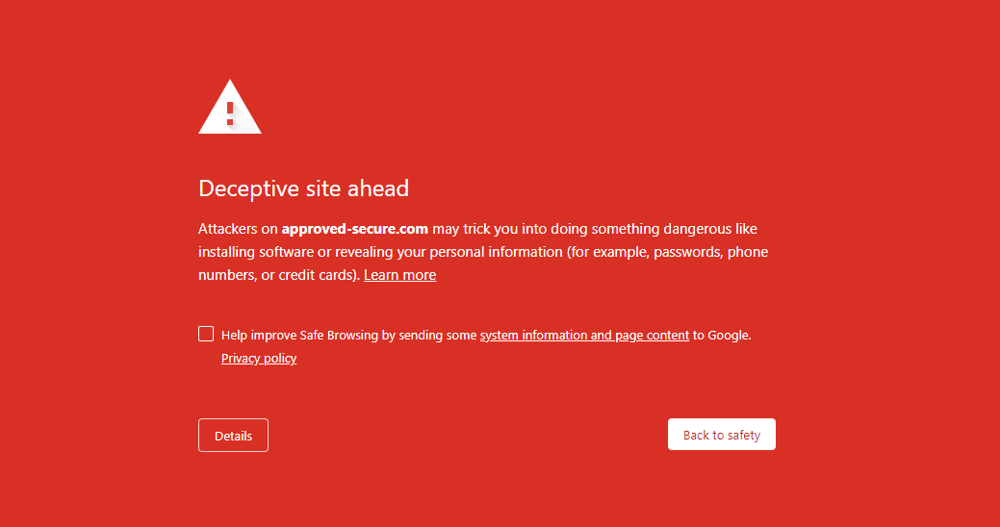
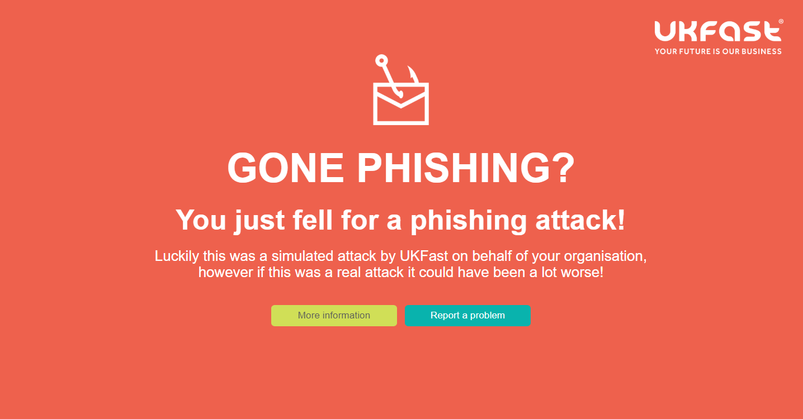

# Troubleshooting

### I'm not receiving phishing emails

If you're not receiving emails send from UKFast PHaaS, it's most likely being blocked by your email filter.

Please double check that the email you have entered in MyUKFast is correct. Then, confirm with your IT department that emails from our email servers (178.238.132.248 185.207.111.242) have been allowed, preventing them from being blocked by your email filters.

If you'd like to send a test email to one email address before starting a campaign, please raise a support request with UKFast, detailing the email address you'd like to send the test email to and what email template you'd like to use.

### The emails get marked as SPAM

If emails are being marked as SPAM, please raise a support request with UKFast who will be happy to help. We may ask you to forward the email as an attachment to us so that we may inspect the email headers and make changes to our campaign templates to prevent them from being marked as spam.

In addition, please double-check that the email you have entered in MyUKFast is correct. Then, confirm with your IT department that emails from our email servers (178.238.132.248 185.207.111.242) have been allowed, preventing them from being blocked by your email filters.

If you'd like to send a test email to one email address before starting a campaign, please raise a support request with UKFast, detailing the email address you'd like to send the test email to and what email template you'd like to use.

### The links in the emails are not working

If links in our phishing emails are not working, please double-check that your campaign has not expired by logging into MyUKFast. If the campaign status is set to anything other than "In Progress", the email links will not work.

If you have checked the above and email links are still not working, please contact your IT department and ask them if there are any blocklists in place to prevent you from accessing that link. They may need to add an allow rule to permit access.

If you'd like to send a test email to one email address before starting a campaign, please raise a support request with UKFast, detailing the email address you'd like to send the test email to and what email template you'd like to use.

Should all else fail, please raise a support request with UKFast support and we will look into this further for you.

### The links open a page that says "Deceptive site ahead"

If you see a message that says "Deceptive site ahead" like the example below, please get in touch with UKFast support and provide the domain that you were trying to access. Our engineers will be happy to look into further for you.



### When clicking the link I go to a website that says "You just fell for a phishing attack!"

When a user falls for a phishing attack, they a redirected to a website that looks like the example below. This is normal behaviour.

If you are taken to this website immediately when clicking the links in emails without, please double-check that your campaign has not expired by logging into MyUKFast. If the campaign status is set to anything other than "In Progress", the email links will not work.

If the above has been checked and the issue still occurs, please raise a support request with UKFast who will be happy to help.




```eval_rst
.. meta::
   :title: Phishing as a Service | UKFast Documentation
   :description: Guidance on Phsihing solutions from UKFast
   :keywords: security, email, phishing, alerts, blocking, hacking, ransomware, protection
```
