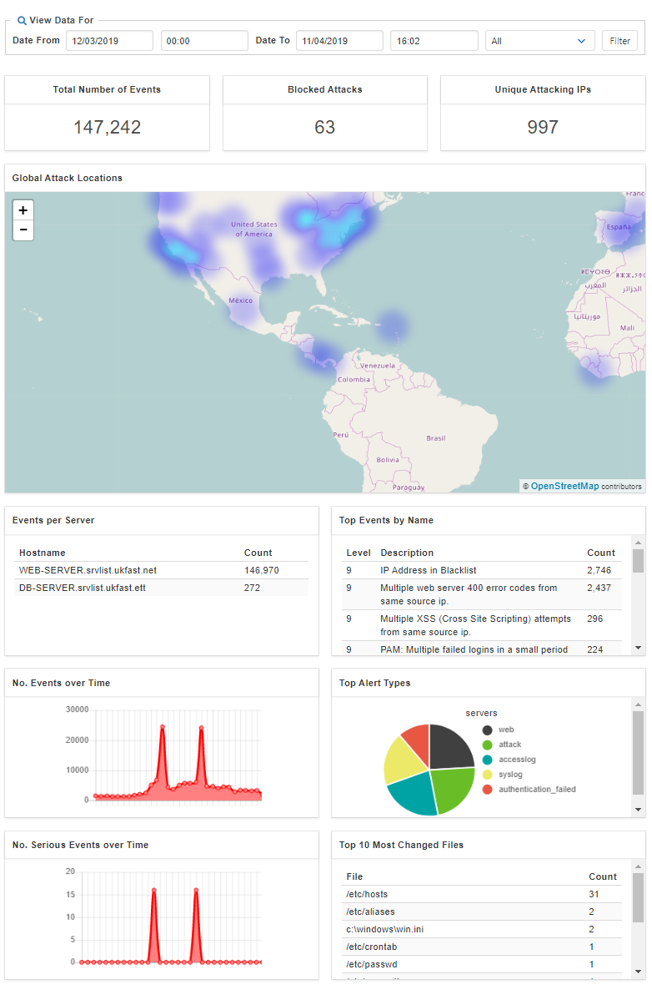
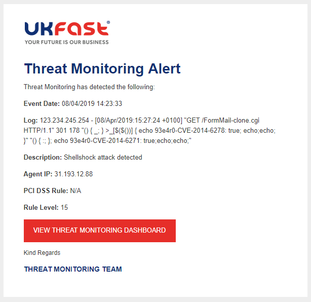

# Alerts and rulesets

## Rule Categories and Groups

Once Threat Monitoring has been installed, your server's logs will start to be parsed through our threat detection rule set. These rules interrogate your server's logs, detecting any suspicious activity, ongoing threats and using intelligence from previous events to detect attacks over time.

Our rule set is organised into rule groups, categorizing similar rules together. Through your MyUKFast dashboard, you can compare and contrast these rule groups, building an image of common threat event types, trends and key areas to improve security. Some example groups include:

* Service groups, such as SSH, FTP and Web Traffic
* Authentication Failures
* Web Application Attacks
* File Integrity Monitoring
* Rootkit detection

More rule groups can be viewed as they are generated in MyUKFast.

## Rule Levels

All events collected by Threat monitoring as assigned a severity level, on a scale of 1 to 15. Events that have a severity level with 10 or more are sent alerted on, through MyUKFast and as an email alert.

- **Critical (14-16)** -
Critical alerts which need to be investigated immediately; indicators of a system compromise, for example, successful logins after multiple failed attempts, severe exploit attempts, and Rootkit events. An immediate investigation is required.

**Example Events:**

`sshd: SSH CRC-32 Compensation attack`

`Attacks followed by the addition of a user.`

`Shellshock attack detected`

- **High (10-13)** -
High-level alerts which may need quick investigation, such as successful logins from unknown IP addresses, change of user account permissions, common attacks and web exploits. These events should be infrequent and not ignored.

**Example Events:**

`System user successfully logged to the system.`

`McAfee Windows AV - Virus detected and not removed.`

`sshd: brute force trying to get access to the system..`

- **Normal (6-9)** -
Events categorised as expected user activity that should be monitored. For example, successful logins during normal business hours from known IP addresses.

**Example Events:**

`sendmail: Multiple attempts to send e-mail from invalid/unknown sender domain.`

`Ports status (netstat) changed (new port opened or closed).`

`sendmail: Attempt to use mail server as a relay (550: Requested action not taken).`


- **Low (1-5)** -
Low-level events that are expected on systems during day-to-day use. Usually created by the system itself, they may include failover events from users clusters or Windows audit success/failures for Kerberos tickets / NTLM. These events are high volume and can generally be ignored, but will be visible on your [MyUKFast Threat Monitoring dashboard](#myukfast-dashboard) for use in data analysis.

**Example Events:**

`User successfully changed UID to root.`

`New dpkg (Debian Package) requested to install.`

`CMS (WordPress or Joomla) login attempt.`

## MyUKFast Dashboard

Built with data analysis and transparency in mind, your Threat Monitoring dashboard, accessible through your MyUKFast, is your insight into threats, real-time attack data, common file changes and blocked attacks to name a few. Here you'll be able to see metrics regarding your server's attack status, the most common types of events on your server, the most triggered events and data analysis graphs showing useful diagnosis information.

Shown below is an example Threat Monitoring dashboard.

<div style="text-align: center;">



</div>

## Email Alerts

Ensuring that you're always informed, any high or critical events are sent as an alert to a predetermined email address, which can be set in the alerts manager section in MyUKFast. Email alerts will contain a brief description of the alert, the agent IP address (Your server) and the full log that triggered the alert.

Shown below is an example Threat Monitoring email alert. In the below alert, we can see that a shell shock attack, a level 15 alert has been detected.

<div style="text-align: center;">



</div>


```eval_rst
   .. title:: Threat Monitoring alerts
   .. meta::
      :title: Threat Monitoring alerts | ANS Documentation
      :description: Guidance relating to alerts raised by UKFast's Threat Monitoring solution
      :keywords: threat monitoring, alerts, security, compliance, critical, rules, rulesets, ukfast, hosting
```
