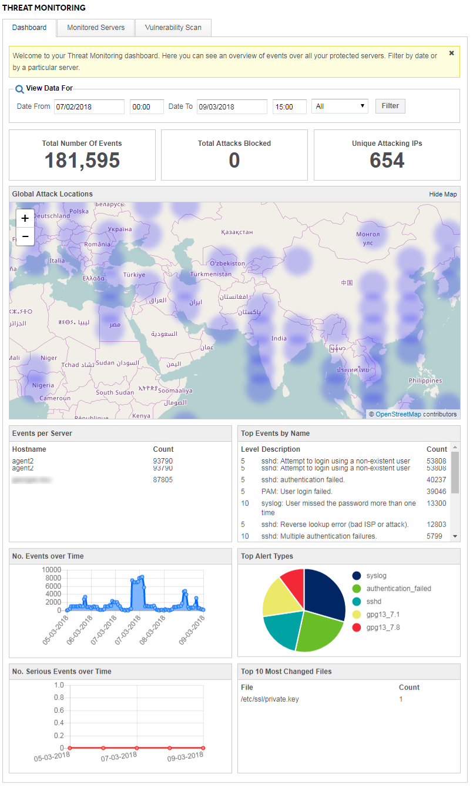

# Alerts and rulesets 

The alerts you wish to have generated will depend on your specific requirements, which you will define in the [planning phase](/security/threatmonitoring/gettingstarted.html)

Examples of events that can be detected include: users logging onto your infrastructure out of core business hours, multiple failed attempts to log in to a server, followed by a successful log in, or unusual changes to key systems files.

You can choose to categorise alerts as follows:

- **Critical (14-16)** -
Critical alerts which need to be investigated immediately; indicators of a system compromise, for example successful logins after multiple failed attempts, modifications to core system files, modifications to payment gateway files. Immediate investigation required.

- **High (11-13)** -
High level alerts which may need quick investigation, such as successful logins from unknown IP addresses, change of user account permissions. These events should be infrequent and not ignored.

- **Normal (6-10)** -
Events categorised as expected user activity that should be monitored. For example, successful logins during normal business hours from known IP addresses.

- **Low (1-5)** -
Low-level events that are expected on systems during day-to-day use. Usually created by the system itself, they may include failover events from users clusters, or Windows audit success / failures for Kerberos tickets / NTLM. These events are high volume and can generally be ignored, but will be visible on your [MyUKFast Threat Monitoring dashboard](#myukfast-dashboard).

You should be careful to categorise your alerts and rulesets, such that you are not overwhelmed by alerts for normal expected user behaviour.  The UKFast security team can advise you on this during the planning phase.

## MyUKFast dashboard

You can gain a real-time view of all your Threat Monitoring alerts in the [Threat Monitoring section of MyUKFast](https://my.ukfast.co.uk/threat-monitoring/) in the `Dashboard` tab, which will look as follows:




```eval_rst
.. meta::
     :title: Threat Monitoring alerts | UKFast Documentation
     :description: Guidance relating to alerts raised by UKFast's Threat Monitoring solution
     :keywords: threat monitoring, alerts, security, compliance, critical, rules, rulesets, ukfast, hosting
```
