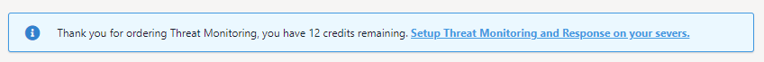

# Getting Started

Before installing Threat Monitoring, take a look at the [system requirements](https://docs.ukfast.co.uk/security/threatmonitoring/system-requirements.html) for Threat Monitoring to verify that your server(s) are compatible. Once this has been verified, please contact your [account manager](https://portal.ans.co.uk/account/your-account-manager.php) to purchase Threat Monitroing and Threat Response Credits for your account.

More information on the differences between Threat Monitoring and Threat Response can be found in our [general information](https://docs.ukfast.co.uk/security/threatmonitoring/general-information.html) documentation.

### Purchasing credits and Installing

You can view your credit balance logging into MyUKFast, navigating to the Threat Monitoring dashboard and clicking on [Setup Threat Monitoring and Response on your servers](https://portal.ans.co.uk/threat-monitoring/configuration)" as shown below.



Once credits have been assigned to your account, you can complete the installation process via MyUKFast. We have documentation available for both [UKFast hosted servers](https://docs.ukfast.co.uk/security/threatmonitoring/ukfast-hosted-install.html) and [Non-UKFast hosted servers](https://docs.ukfast.co.uk/security/threatmonitoring/non-ukfast-install.html).

### Setup and Walkthrough

Once the installation process has been started, your account manager will be more than happy to schedule in a call with yourselves and a UKFast security engineer for when the installation process has succeeded. During this call, the engineer will walk you through the Threat Monitoring dashboard, explaining key aspects of the dashboard and providing any guidance on usage and navigation.

Additionally, the security engineer will be happy to launch a vulnerability scan with you, scanning your server for potential vulnerabilities, insecure configurations and outdated software. The engineer will also walk through the Alerts dashboard and set up Contacts to receive Threat Monitoring emails alerts.

After the call, the engineer will send you across our Threat Monitoring questionnaire, in here you can detail:

* Scheduled Malware scans
* Rootkit scanning
* Types of control panels installed
* IP addresses to be allowed from active response
* Custom File Integrity Monitoring locations

## Configuration Phase

Once Threat Monitoring has been installed and the questionnaire has been completed, an engineer will begin tailoring Threat Monitoring to your needs, as specified in the questionnaire. If you have any changes that you'd like to make to this configuration, you can always raise a support ticket or call UKFast support.

---

If you have additional servers you wish to install Threat Monitoring onto, please speak to your [UKFast Account Manager](https://portal.ans.co.uk/account/your-account-manager.php).

```eval_rst
     .. title::  Getting started with Threat Monitoring
     .. meta::
          :title: Getting started with Threat Monitoring | UKFast Documentation
          :description: Guidance on getting started with UKFast's Threat Monitoring
          :keywords: threat monitoring, alerts, security, compliance, rules, rulesets, ukfast, hosting, file integrity monitoring, rootkit, detection, vulnerability scan, scans, hids, intrusion detection, set up

