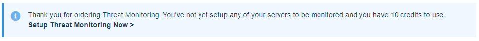
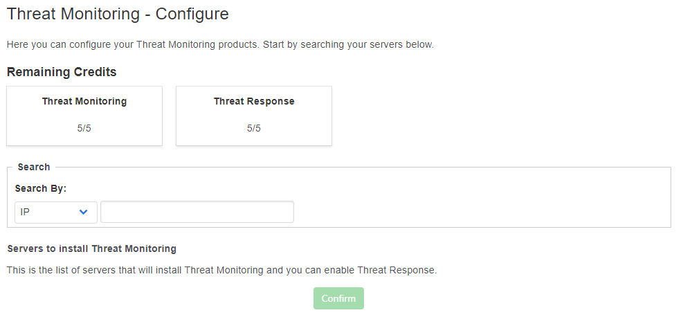

# Getting Started

## Installation phase

### Assigning Credits

Before Threat Monitoring is installed, you'll be assigned credits which can be applied to selected servers through MyUKFast. You can view these credits by logging into MyUKFast, navigating to the Threat Monitoring dashboard and clicking on "Setup Threat Monitoring Now >" as shown below.

<div style="text-align: center;">



</div>

Here you can assign your Threat Monitoring credits to the required servers. After hitting confirm, that server will run through our automated install process, which usually takes up to 24 hours to install your server with Threat Monitoring. 

While that's running, you can go ahead and apply any Threat Response Credits to servers that you've  assigned Threat Monitoring Credits to. Alerts from these servers will now go directly to our dedicated Threat Response team.

<div style="text-align: center; border: 1px solid black;">



</div>

### Setup and Walkthrough

Once the installation process has been started, your account manager will be more than happy to schedule in a call with yourselves and a UKFast security engineer for when the installation process has succeeded. During this call, the engineer will walk you through the Threat Monitoring dashboard, explaining key aspects of the dashboard and providing any guidance on usage and navigation.

Additionally, the security engineer will be more than happy to launch a vulnerability scan with you, scanning your server for potential vulnerabilities, insecure configurations and outdated software. The engineer will also walk through the Alerts dashboard and set up Contacts to receive Threat Monitoring emails alerts. 

After the call, the engineer will send you across our Threat Monitoring questionnaire, in here you can detail:

* Scheduled Malware scans
* Rootkit scanning
* Types of control panels installed
* IP addresses to be allowed from active response
* Custom File Integrity Monitoring locations

## Configuration Phase

Once Threat Monitoring has been installed and the questionnaire has been completed, an engineer will begin tailoring Threat Monitoring to your needs, as specified in the questionnaire. If you have any changes that you'd like to make to this configuration, you can always raise a support ticket or call UKFast support.

---

If you have additional servers you wish to install Threat Monitoring onto, please speak to your [UKFast Account Manager](https://my.ukfast.co.uk/account/your-account-manager.php).

```eval_rst
.. meta::
     :title: Getting started with Threat Monitoring | UKFast Documentation
     :description: Guidance on getting started with UKFast's Threat Monitoring
     :keywords: threat monitoring, alerts, security, compliance, rules, rulesets, ukfast, hosting, file integrity monitoring, rootkit, detection, vulnerability scan, scans, hids, intrusion detection, set up

