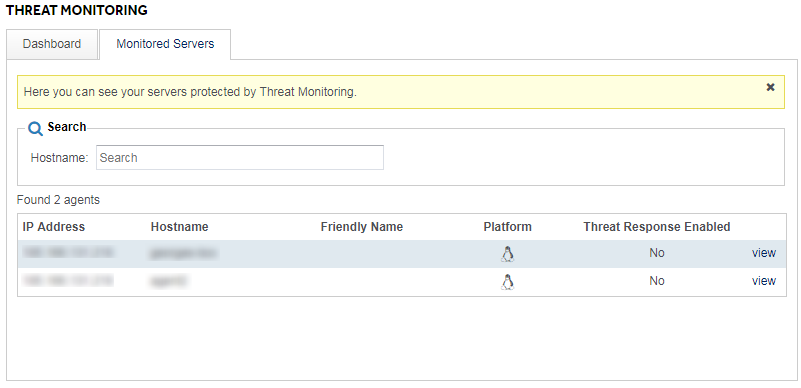

# Getting Started

## Planning Phase

During the planning phase you will work with a UKFast security specialist to define a number of variables specifically for your Threat Monitoring solution.  During this phase you will need to provide:

1.	The core system files or directories to be monitored
2.	Your preferred schedule of vulnerability scans
3.	Any custom alerts you wish to operate, over an above the default rulesets
4.  The contact details (email addresses and/or telephone numbers) where alerts should be delivered to

## Implementation Phase

Once the planning variables have been established, a UKFast security specialist will install your Threat Monitoring agent(s) and configure these as per your requirements.

From this point you will start receiving notifications should your variables generate any alerts.

You will also be able to view and confirm which servers have Threat Monitoring installed by going to the [Threat Monitoring area in MyUKFast](https://my.ukfast.co.uk/threat-monitoring/).  If you click on the `Monitored Servers` tab you will see a table as follows:

