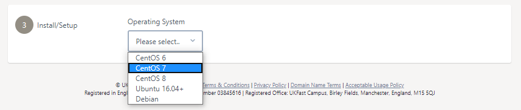

# Installing Threat Monitoring on a non-UKFast server

Threat Monitoring can also be installed on servers that are not hosted with UKFast, allowing you to secure and protect all parts of your IT infrastructure via one centralised threat defence platform.

To begin, log into MyUKFast and visit the Threat Monitoring new agent configuration page https://my.ukfast.co.uk/threat-monitoring/configuration then select `Non UKFast` from the `Hosting Type` drop-down option.

```eval_rst
.. warning::
   This documentation is for setting on a non-UKFast hosted server with Threat Monitoring. Instructions on how to install Threat Monitoring and Response on a UKFast hosted server can be found in our [Installing Threat Monitoring on a UKFast hosted server](/security/threat-monitoring/ukfast-hosted-install) documentation.
```


To install UKFast Threat Monitoring on a non-UKFast hosted server, follow these steps:

**[1. Add an API token](#add-api-token)** to link your servers to Threat Monitoring

**[2. Setup firewall](#setup-firewall)** your firewall to allow communication

**[3. Configure and install](#configure-and-install)** threat monitoring onto your server.


```eval_rst
.. warning::

   Threat Monitoring only supports a specific set of operating systems and configurations. Please make sure your server meets the minimum required specification and required requirements as defined in our [System Requirements](/security/threat-monitoring/system-requirements) documentation.

```

## 1) Add an API token

Firstly, generate or use an existing UKFast API application token. This application token will be used to communicate with the UKFast public API to register a new threat monitoring agent. If you already have a UKFast API application token with permissions to access Threat Monitoring, you can enter it in the box provided, as shown below.


If you don't have an existing API application token, or would like to generate a new application token, you can generate one by pressing the blue `Generate Application Token` button provided, as shown below. The generated token will be entered into the text box for you. Furthermore, application tokens can be managed via https://my.ukfast.co.uk/applications/index.php


## 2) Setup firewall

Before configuring your agent, verify that that the target server has the correct firewall ports open to communicate outbound to both the UKFast API servers and the Threat Monitoring ingest servers, the required details are shown below.

| Destination IP | Destination Port | Protocol | Description |
|-----|-----|-----|-----|
| 185.234.39.17 | 443 | TCP | UKFast API servers |
| 178.238.133.128 | 443 | TCP | Threat Monitoring ingest servers|

Communication can be tested on a Linux system using a utility like `netcat`, an example command to verify communication are shown below. Please note the `netcat` command may be mapped to the `nc` command instead.

**Command**
`netcat -z -v 185.234.39.17 443`

**Success Response**

```
Ncat: Version 7.50 ( https://nmap.org/ncat )
Ncat: Connected to 185.234.39.17:443.
Ncat: 0 bytes sent, 0 bytes received in 0.02 seconds.
```


## 3) Configure and install

Next, select the operating system type of the target server via the provided  `Operating System` drop-down, as shown below. Please operating systems now shown are not supported on non-ukfast Threat Monitoring installs.



Upon selecting your OS, the needed commands will be shown to you. These commands will need to be run via the command line via a terminal like SSH on your server. 

The provided commands will attempt to escalate to the privileged root user (`sudo -i`). If your current user is not able to escalate it's permissions to the root user or not able to run the `sudo` command, please re-try from a different account with the correct permissions. Alternatively, you may run the commands using the root user directly.

When you have root access, please continue with the next 2 commands. These commands will install our UKFast Defensive Security yum or apt package repository onto your server and then install our Threat Monitoring package and its dependencies.

Once the package has been installed successfully, you need to perform 1 final step to link your server up to our Threat Monitoring infrastructure. 

Before we do that, you have the option of setting a custom friendly name for this server that will later be shown in any Threat Monitoring dashboards when referring to this server. You can either specify this optional manually using the `-name=NAME_HERE` flag or by entering your desired server in the `Name` text box provided in the MyUKfast installation page. Updating this text box will automatically update the commands that we need to run next.

Finally, run the provided command to complete your install. Upon completion, you should see a success message reading, `Success! Your Threat Monitoring Agent is now configured and working`. An example setup is shown below.


If you do encounter any issues during installation, please get in contact with UKFast support.


```eval_rst
.. meta::
     :title: Installing Threat Monitoring on a non-UKFast server | UKFast Documentation
     :description: Guidance on installing UKFast's Threat Monitoring on a non-UKFast server
     :keywords: threat monitoring, alerts, security, compliance, rules, rulesets, ukfast, hosting, file integrity monitoring, rootkit, detection, vulnerability scan, scans, hids, intrusion detection, set up
