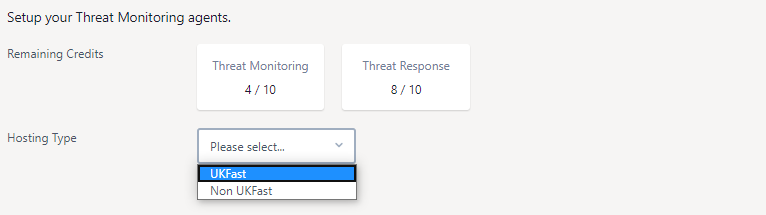
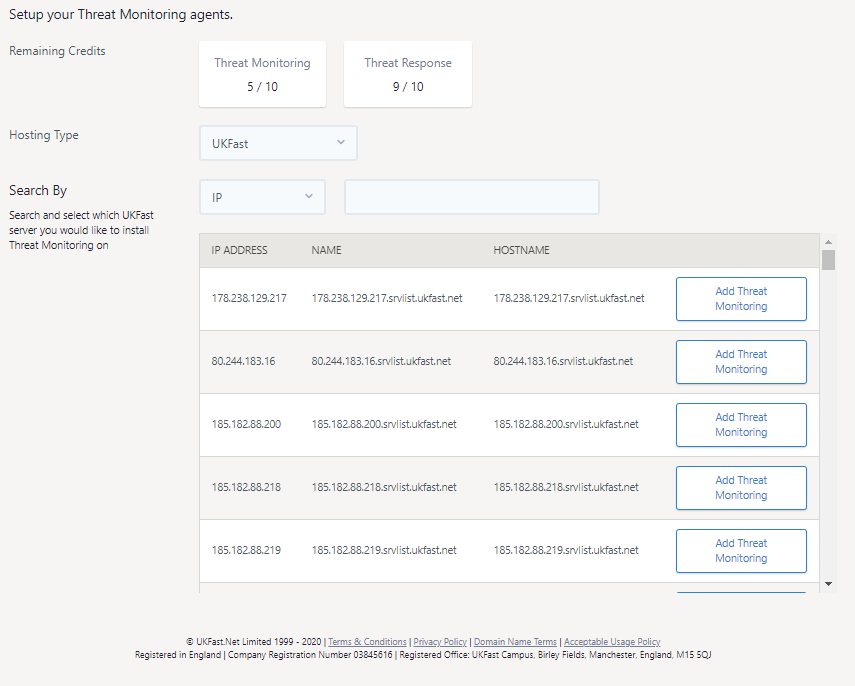
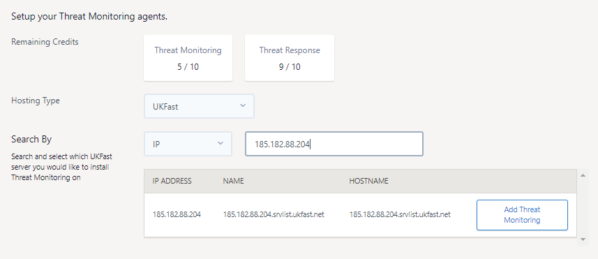
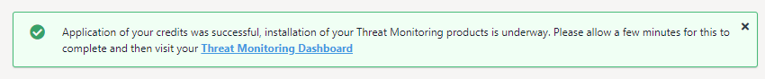
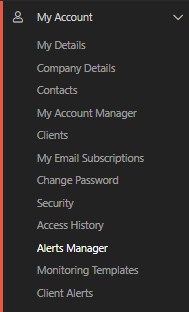
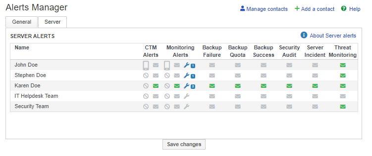

# Installing on a UKFast hosted server

```eval_rst
.. warning::
   This documentation is for setting on a UKFast hosted server with Threat Monitoring. Instructions on how to install Threat Monitoring and Response on a non-UKFast hosted server can be found in our :doc:`non-ukfast-install` documentation.
```

Threat Monitoring and Threat Response can be installed on servers that are hosted with UKFast, allowing you to secure and protect all parts of your UKFast hosted IT infrastructure via one centralised threat defence platform.

To begin, log into MyUKFast and visit the Threat Monitoring agent configuration page https://my.ukfast.co.uk/threat-monitoring/configuration then select `UKFast` from the `Hosting Type` drop-down option.




To install UKFast Threat Monitoring on a UKFast hosted server, follow these steps:

**[1. Select a server](#add-api-token)** to install Threat Monitoring

**[2. Configure and install](#configure-and-install)** threat monitoring onto your server.

**[3. Setup email contacts](#setup-email-contacts)** to receive email alerts. 


```eval_rst
.. warning::

   Threat Monitoring only supports a specific set of operating systems and configurations. Please make sure your server meets the minimum required specification and required requirements as defined in our :doc:`/security/threat-monitoring/system-requirements` documentation.

```

## 1) Select a server

Firstly, using the list shown on the configuration page, select the server you want to install with Threat Monitoring by pressing the blue "Add Threat Monitoring" button, as shown below.



You may filter the list of shown servers by the `IP Address`, `Name` or `Hostname` of the server. Simply select the search type using the "Search By" drop-down and enter your search criteria ion the next box provided, as shown below.



Adding Threat Monitoring to a server will consume a Threat Monitoring credit. Your remaining Threat Monitoring and Threat Response credits are shown at the top of the configuration page.


## 2) Configure and install

Once your chosen server(s) are selected, they will appear towards the bottom of the page in an "Install On" section. 

You can remove a server from the "Install On" list via the red bin icon.

If you would also like to install Threat Response into any of these selected servers, select the "THREAT RESPONSE" checkmark next to the server. Doing this will consume a Threat Response credit, as shown below.


Once you are happy with your selection, press the "Install Agent" button to launch the automated installation process.

When the servers have been successfully queued for automation, you will see a green success message like the below.



The automated installation process normally takes 5 minutes per server. Once the installation process has completed you will start to see data for the server in your Threat Monitoring dashboard, view alerts and run vulnerability scans.

If you do encounter any issues during installation, please get in contact with UKFast support.

## 3) Setup email contacts

To receive email alerts for suspicious events, you will need to configure email alerts via MyUKFast. To do this, go to the "Alerts Manager" section under "My Account", as shown below.



On the Alerts Manager page, select the "Server" tab. On here you will see a table of contacts and the types of alerts they have been configured to receive. 

To set a contact to receive Threat Monitoring alerts, press the letter icon next to their name under the Threat Monitoring column and then press the "Save Changes" button, an example is shown below.




```eval_rst
   .. title::  Installing Threat Monitoring on a non-UKFast server
   .. meta::
        :title: Installing Threat Monitoring on a non-UKFast server | UKFast Documentation
        :description: Guidance on installing UKFast's Threat Monitoring on a non-UKFast server
        :keywords: threat monitoring, alerts, security, compliance, rules, rulesets, ukfast, hosting, file integrity monitoring, rootkit, detection, vulnerability scan, scans, hids, intrusion detection, set up
```
