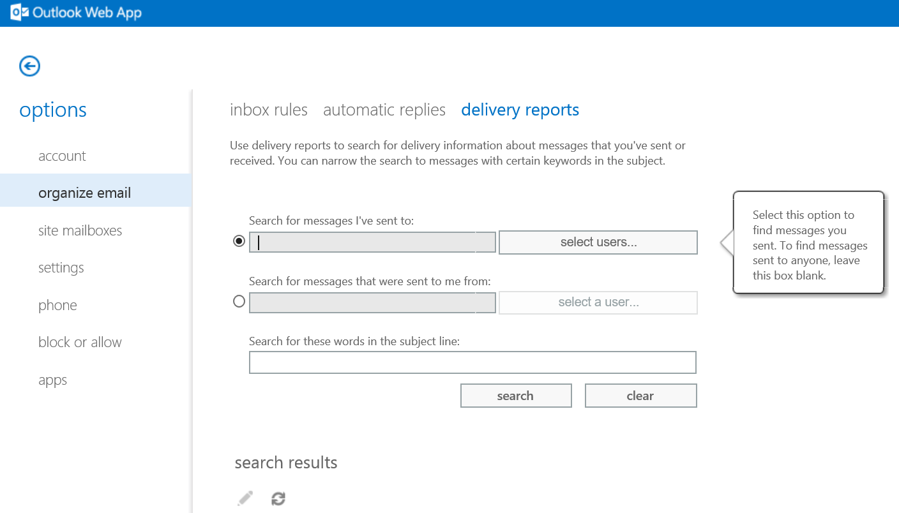

# How do i Track a Message That i Have Sent Using Shared Exchange

It's possible to track a message you have sent via the Hosted Exchange Servers.

This is via Outlook Web App, which can be accessed via https://client.ukfastexchange.co.uk/ecp

Once logged in select Organize email from the left plane> Delivery reports from the headings across the top.

Under the "Search for messages I've sent to" Click, Selected Users ...

 A new window will open, where you are able to type the recipient of the email address you'd like to track in the To:  field. Select Ok, once finished.

Click search

Your results will be displayed along with the status of delivery.
