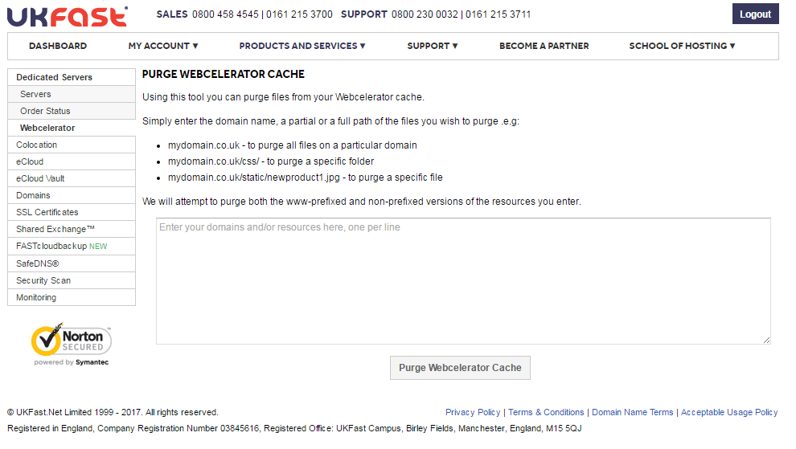

# How to Purge the Webcelerator Cache

Sometimes when you push an update to your website, you'll need to purge some of the items stored in the Webcelerator cache to force it to pull down a copy of the new file before the cached version has expired. To facilitate this, there are a few ways to purge a single object or a whole domain from the cache.

## Purging via MyUKFast

We provide an interface to purge your Webcelerator cache via [MyUKFast](https://portal.ans.co.uk), which can be found in your list of *Servers* under *Webcelerator*:



Simply enter a domain into the text box, or the URL to a specific file, and click `Purge Webcelerator Cache` to send a purge request to the Webcelerator.

Please note that this sometimes does not work if there are devices in front of the Webcelerator, which would require you to use another purging method below, such as the ones below.

```eval_rst
.. warning::

   If the DNS for your domain does not resolve to the Webcelerator, then this purge method will not work, and will require you to use an alternate purge method. Likewise, if you have a clustered Webcelerator, and there is a failover event, you may need to run your purge again

```
## Purging via cURL

Slightly easier and more scriptable is the use of cURL. The following command does the same as the above. (For clarity, that's a capital 'i' and a zero):

```console
curl -I0 -X PURGE -H "Host: www.example.com" http://198.51.100.200/images/logo.png
```

This would return a `200 OK` response code if the purge was successful.

```console
HTTP/1.1 200 Purged.
Accept-Ranges: bytes
Date: Wed, 17 Oct 2012 09:00:47 GMT
Age: 0
Connection: close
X-Cache: MISS
Server: WebCelerate
Via: WebCelerate
```

## Purging via telnet

You can submit purge requests via `telnet` if you so wish:

```console
[user@server ~]# telnet 198.51.100.200 80
Trying 198.51.100.200...
Connected to 198.51.100.200.srvlist.ukfast.net (198.51.100.200)
Escape character is '^]'.
PURGE /images/logo.png HTTP/1.0
Host: www.example.com
```

Which should return a `200 OK` response code if the purge was successful.

## Purging via PHP

You could also submit purge requests from your application to do this programmatically as required. An example of performing a purge in PHP follows – note that you will need the `pecl_http` module installing (on Linux boxes this can be done with the command `pecl install pecl_http`). Adjust `$DomainName`, `$VIP` and the `$request` as desired:

```php
<?php
  $DomainName = "www.example.com";
  $VIP = "198.51.100.200";
  HttpRequest::methodRegister('PURGE');
  $request = new HttpRequest("http://$VIP/images/logo.png",
  HttpRequest::METH_PURGE);
  $request->setHeaders(array('Host' => "$DomainName"));
  try {
    $request->send();
    var_dump($request->getResponseCode());
    if ($request->getResponseCode() == 200) {
      echo "Success!!";
    }
  } catch (HttpException $exception) {
    echo $exception;
  }
?>
```

```eval_rst
  .. title:: Webcelerator | How to Purge the Webcelerator Cache
  .. meta::
     :title: Webcelerator | How to Purge the Webcelerator Cache | ANS Documentation
     :description: Webcelerator | How to Purge the Webcelerator Cache
     :keywords:  webcel, webcelerator, cache, clear, linux, php, curl, server, guide, tutorial
```
