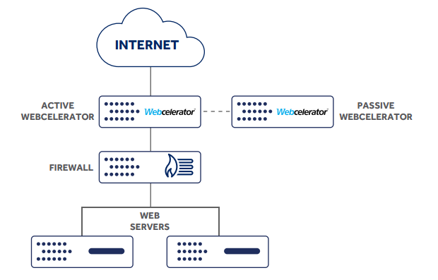

# Introduction

The Webcelerator (or "Webcel") is a caching appliance that sits in-front of your server solution and acts as a reverse proxy for your site.

Static content, such as CSS, JavaScript, and images are cached and served directly from the Webcelerator instead of loading from your backend server. This frees up resources on the backend to perform critical tasks such as database queries or processing PHP.

We also perform optimisation of the content stored in the Webcelerator cache to serve it more quickly than it may have been served from the backend directly.

With a Webcelerator in place, you can also implement custom configuration to perform some more advanced routing of traffic, including

* load balancing over more than one backend
* routing traffic to different backends based on domain
* presenting a maintenance page, in the event that your backends are offline

## Solution Diagram



The Webcelerator sits outside of the firewall, most commonly in an active/passive pair for redundancy. Should one Webcelerator go offline, failover between them should take no more than a few seconds, and most users wouldn't notice any disruption.

## Default configuration

Out of the box, the Webcelerator has a default set of rules that is fairly aggressive about caching static content. The following file types are forcibly cached for 2 hours by default:

* `jpeg`
* `jpg`
* `gif`
* `png`
* `css`
* `js`
* `xml`
* `txt`
* `ico`
* `xpm`
* `swf`
* `flv`
* `pdf`

'Forcibly cached' means that the Webcelerator will strip `cookie`, `expires`, `pragma`, and `cache-control` headers from these file types, set its own `cache-control` headers of `max-age=7200 public` and add them to the cache. A guide to understanding cache control headers can by found [here](https://varvy.com/pagespeed/cache-control.html).

This setup will give you some benefits of the Webcelerator but for an optimal solution, our engineers will work with you to create a configuration for your site's specific requirements.

```eval_rst
   .. title:: Webcelerator | General Information
   .. meta::
      :title: Webcelerator | General Information | ANS Documentation
      :description: General information on UKFast Webcelerators
```
