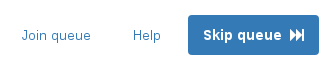
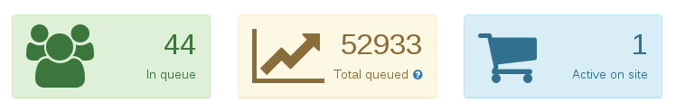
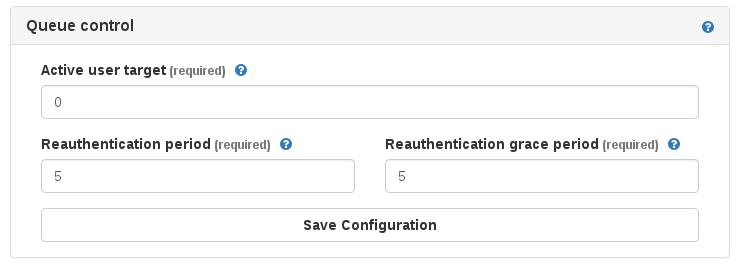
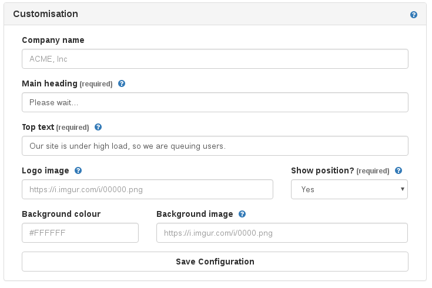

# Administering your queue

For you to track metrics about the queue system, change the number of users allowed through and how often they should confirm they are still active, as well as customising the queue holding page.

## Testing the queue

There are two options at the top of the page to allow you to test the queue or access your site:



* **Join queue**: This will open a new tab and put you to the back of the queue of whichever site you browsed to the admin panel via.
* **Skip queue**: This will open a new tab directly on your live site (whichever one you browsed to the admin panel via), skipping the queue for 12 hours on your browser.

## Queue statistics

The panel allows you to view three key metrics about the queue system:

* How many users are currently being actively held in the queue
* How many users have been in the queue today in total
* How many users have been released from the queue and are considered "active" on the site

This is updated whenever you refresh the admin page.



You can correlate this data with information from Google Analytics and other sources to make informed choices about the configuration in the "Queue control" section of the panel.

## Queue control

The "Queue control" section of the panel allows you to manage how the queue actually works on your Webcelerator.



The following items can be configured:

* **Active user target**: This is the number of users your would like to have sent through to your site at one time. Generally, it is best to set this slightly lower than the value you're aiming for, as the calculation of how to release users can cause a few extra to be allowed through on occasion. However, setting this to "10" should mean that you will have 10 customers on your site at a time - once one leaves and times out, a new customer will be permitted through.

* **Reauthetication period**: This controls how often *(in minutes)* the visitor should be silently redirected back to the queue system to confirm they are still active on the site. Users won't notice this interaction, but setting this too low might cause problems with your site.

* **Reauthentication grace**: This controls how many minutes after the reauthentication period we should consider the user inactive and time out their session. If they then come back to the site after this time, they will be put to the back of the queue.

As such, the queue system will aim to maintain a user concurrency on your site of `active user target`, confirming that they are still browsing every `reauthentication period` minutes, and giving their slot to another visitor if they haven't clicked in `rauthentication period` + `reauthentication grace period`.

Setting the active user target to `0` will cause all requests to be queued, which might be handy for testing.

## Customising the holding page

There are a handful of options available to you to customise the queue holding page, which will be applied to all new queued users.



The following items can be configured:

* **Company name**: Sets the company name that is displayed in the title bar of the queue holing page.
* **Main heading** *(required)*: Sets the heading text at the top of the loading box on the holding page ("Please wait..." in the screenshot above).
* **Top text** *(required)*: Sets the text underneath the heading on in the loading box.
* **Logo image**: Sets a logo to appear above the loading box. This will need to be hosted externally, perhaps through a service like [Imgur.com](https://imgur.com). You should place a direct URL to the image file in this field.
* **Show position?** *(required)*: This determines whether the position counter should be shown on the page or not. When set to "No", only the spiking loading icon will be shown.
* **Background colour**: This sets the background colour for the holding page.
* **Background image**: This sets a background image for the holding page. Please note that this will have the following CSS applied: `background-repeat:no-repeat;`. This will need to be hosted externally, perhaps through a service like [Imgur.com](https://imgur.com). You should place a direct URL to the image file in this field.


```eval_rst
.. meta::
   :title: Managing your Webcelerator queue| ANS Documentation
   :description: How to administer your Webcelerator queue system
   :keywords: ukfast, webcel, webcelerator, queue, webcelerate queue admin, traffic, high load
```
