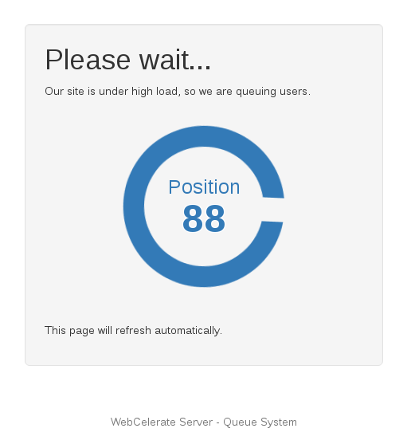

# General information

The Webcelerator queue system is designed for cases where your site receives heavy traffic that causes performance issues or downtime - for example a sale with a larger then expected response.

In these cases, you may not be able to scale your backend solution quickly enough to handle all of the concurrent users, and might be missing out from sales as a result of nobody being able to access your site or it taking an extended amount of time to load.

To mitigate this situation, the queue system allows a set number of active users through to the site at one time, and holds the rest of the users on a "please wait" page.

With this in place, you can let enough users through for your site to remain fast and online, with other users queued up waiting for a spot on the site. While some users might bounce and elect not to wait, you at least still receive the orders for those willing to wait to get through.

## How does it work?

The queue system intercepts the request for site, and sends new users through to a waiting page:



These users then poll for their new position every 5 seconds via an AJAX call, which will update the position on the page.

The backend system then aims to achieve a target number of active users on the site (just under what your server can hold at maximum capacity), and will trickle users through as positions on the site become available.

There is a timeout period where clients will be pushed to the back of the queue after a specified amount of inactivity.

## How is the queue configured?

There is an administrative panel available to configure the target number of users, timeouts, and to view stats on how your queue is performing.

You can also update various styling elements of the holding page to brand this as required.

## How do you know when a user is still browsing the site?

Within the administrative panel, there are configuration options for `Reauthentication period` and `Reauthentication grace period` which specify how often a users should be silently redirected back to the queue system to touch base, and then be immediately redirected back to the page they were expecting.

While not the most accurate way of calculating the active user numbers, it allows the queue to release at a roughly correct rate.


```eval_rst
.. meta::
   :title: General information on the Webcelerator queue system | UKFast Documentation
   :description: The Webcelerator has a queue system which can be used to relieve stress on your backend server.
   :keywords: ukfast, webcel, webcelerator, queue, overloaded
```

