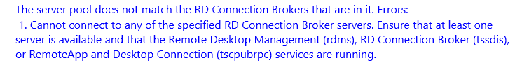

# Server Manager can't connect to Connection Broker

If you see this error in Server Manager, it means that you likely have High Availability Connection Brokers.

HA RDS Connection Brokers rely on SQLSERVER, it is likely that the SQLSERVER service has crashed on your SQL boxes, restart it.
