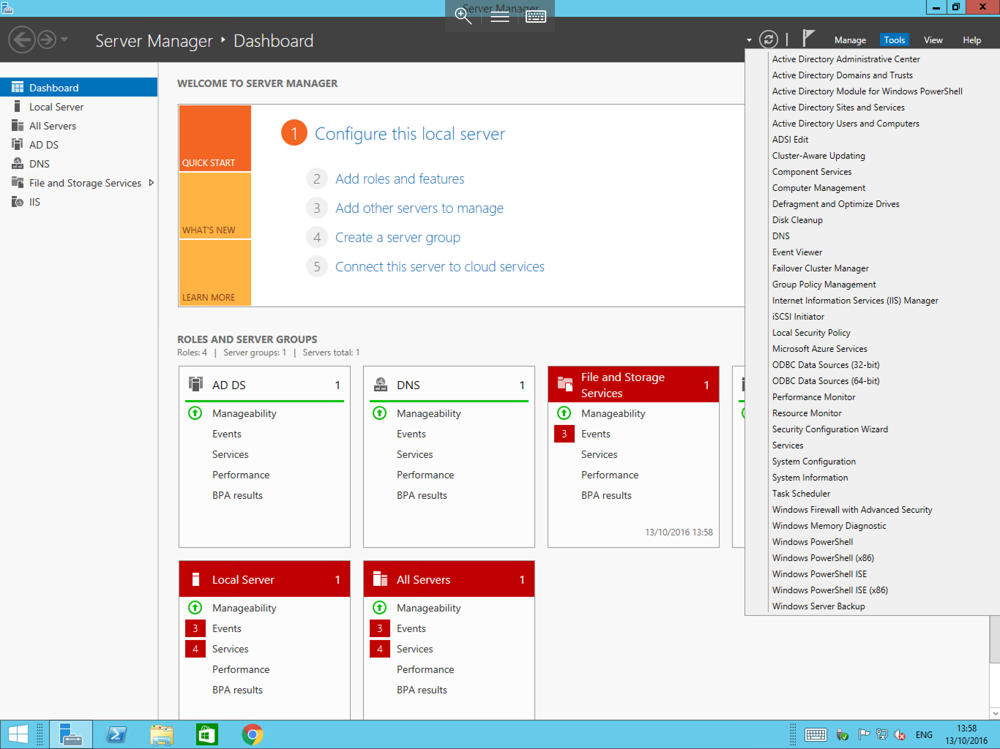
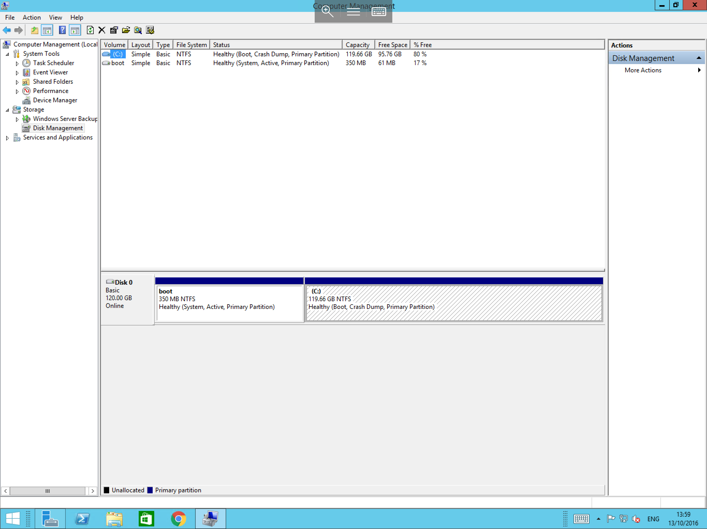
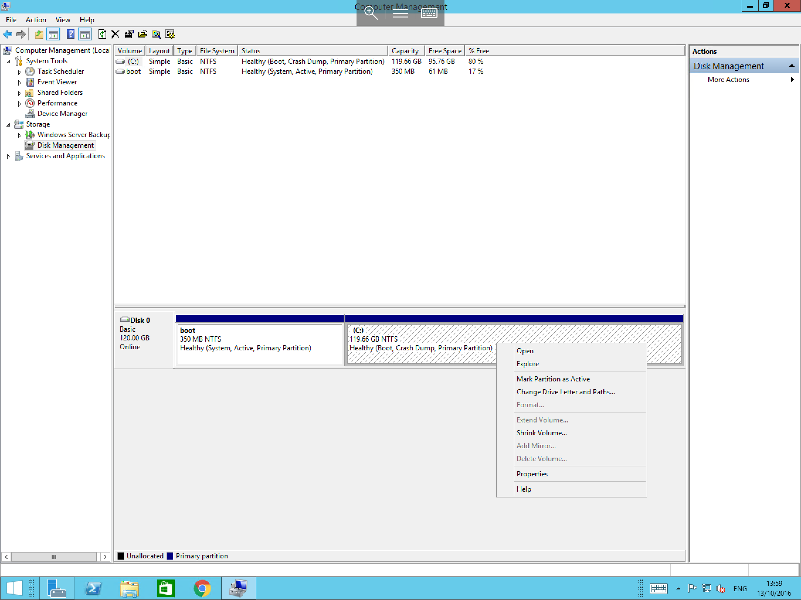

# Windows Disk Management

In windows you can manage the hard disks within your computer by using the Windows Disk Management console, to access this, please follow the below guide

Open the server manager either by selecting the Taskbar shortcut, or by selecting start and selecting server manager from the list of applications.

Once you have opened server manager, please select "Tools", and select "Computer Management" from the list of options as below

you will now be presented with the computer management console, on the left hand side of the window, please pop out the storage section of the list, and select "Disk Management"
In the central field of the window, you should now be presented with the disk management console after a few seconds as below

This console will provide you information about your currently installed hard disk drives, and will also allow you to make changes to the partitionining and filesystems of those hard disks as well as carry out other functions such as extending and shrinking current partitions.
To view this information and to make changes, please select the disk of your choice, and right click to view the available options for that drive as below

